  

# Introducción

[Siliwiz](https://app.siliwiz.com/) es un programa que corre on-line para aprender los **fundamentos del diseño de chips**, desarrollado por 
[Matt Venn](https://zerotoasiccourse.com/matt_venn/) para su curso [Zero to asic](https://zerotoasiccourse.com/)  

En este tutorial vamos a ver cómo diseñar el **layout** de un transistor **MOSFET-N**, y cómo simularlo. En la parte final exportaremos el MOSFET-N a **formato 3D** y lo reconstruiremos con la herramienta [FreeCAD](https://www.freecad.org), para poder usarlo en nuestras documentaciones

Siliwiz NO es para fabricación, sino sólo para uso educativo. La tecnología que usa es una simplificación de la [sky130](https://github.com/gdsfactory/skywater130)

Esto es lo que aparece cuando entramos en la herramienta

  

¿Por qué utilizar este programa?. Estas son las **ventajas** que tiene

**Ventajas**
  * Es **Software Libre**. Pertenece al **Patrimonio tecnológico de la humanidad**. Código fuente: [Siliwiz en Github](https://github.com/TinyTapeout/siliwiz)  
  * Es **on-line**, y se ejecuta desde el **navegador**. Es multiplataforma y no necesita instalación
  * Muy fácil de utilizar
  * Interfaz moderna
  * Muy buena para aprender los fundamentos
  * Simulación básica de los diseños

¿Para qué **NO** nos vale? ¿Qué limitaciones tiene?

**Desventajas**:
  * Usa una **tecnología ficticia** (es una simplificación de sky130)
  * No es posible generar los ficheros **GDS** para fabricación

# Configuración inicial

Cuando se arranca Siliwiz, aparece por defecto el Layout de un **inversor**, construido a partir de un MOSFET-N y un MOSFET-P. Nosotros vamos a diseñar un **MOSFET-N desde 0**, y luego lo simularemos

Lo primero que hacemos es partir de **un diseño en blanco**. Para ello pinchamos en la parte superior y seleccionamos **blank.json**

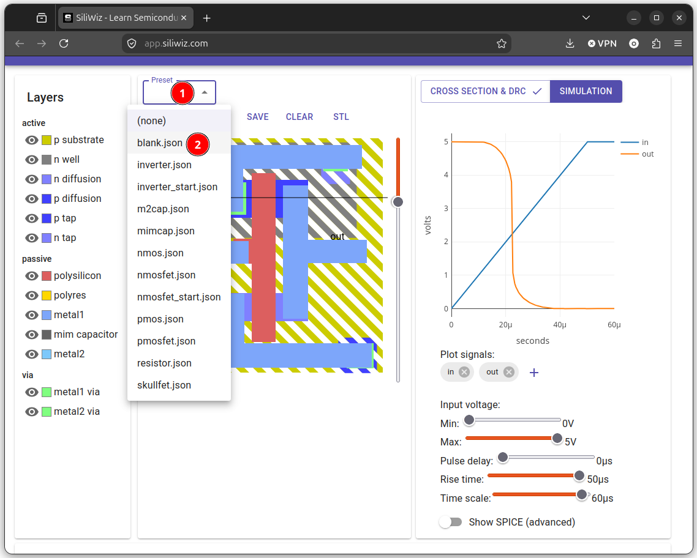  

Aparece un panel en blanco, que es donde vamos a crear nuestro diseño. ¡Estamos listos para empezar!

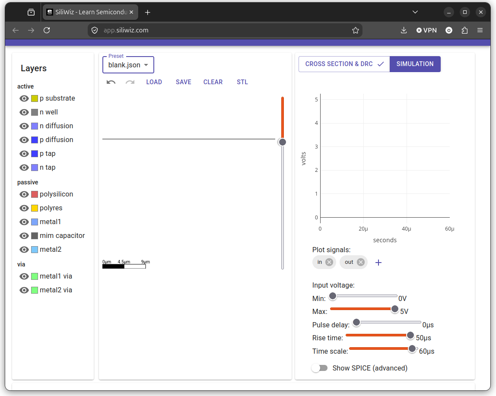  

# Colocando el sustrato

El chips está situado sobre **una capa de Silicio tipo P**, que llamamos **sustrato**. Para colocarlo pinchamos en la parte izquierda donde pone **p sustrate**

  

Pinchamos con el **botón izquierdo** del ratón en la **esquina superior izquierda** de la zona donde posicionar el sustrato y **arrastramos** hasta la **esquina inferior derecha**, donde soltamos el botón

  

Todo lo que se dibuja en el layout son **rectángulos**, por lo que el proceso siempre es el mismo. Lo que vemos es **la vista superior** del diseño (la planta). Sabemos que es el sustrato porque tiene un relleno de rayas oblicuas amarillas y blancas

Para ver la altura del sustrato vamos a visualizar la **sección transversal**. Pinchamos en el botón que pone **CROSS SECTION & DRC**


En la parte de la derecha se encuentra la **sección transversal** donde podemos ver la altura del sustrato. La parte superior del plano de corte se muestra en la izquierda, y se puede mover hacia arriba y abajo con **la barra deslizadora** que separa ambos paneles  

# Silicio tipo N

Lo siguiente es crear la zona de **silicio tipo N** que luego se convertirá en la **fuente** y el **drenador** del MOSFET N. Pinchamos en la capa **n diffusion**

  

Seleccionamos la esquina superior izquierda de la zona N con el **botón izquierdo** del ratón y arrastramos hacia la esquina inferior derecha. Aparece la zona N de color azul

  

Movemos la barra de deslizamiento hacia abajo para atravesar la zona N. En la sección vemos cómo aparece la zona N incrustrada en el sustrato

  

# Colocando el polisilicio

Para crear la puerta utilizamos el **polisilicio**. Seleccionamos la capa **polysilicon** y la colocamos encima de la zona N, atravesándola verticalmente

  

En la sección vemos cómo ahora la herramienta **separa la Zona N en dos**, una para la **fuente** y otra para el **drenador**. Debajo del polisilicio no aparece nada en la sección, pero ahí está situado el **óxido de silicio**

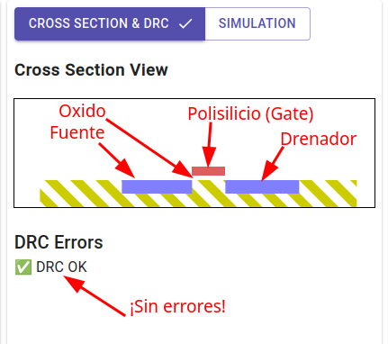  

También observamos que NO HAY ERRORES DRC. Es decir, que no se están violando las **reglas de diseño** (Tamaños, distancias mínimas, etc...)

¡El transistor ya está listo! Ahora tenemos que sacar sus terminales (Fuente, drenador y puerta) hacia los contactos metálicos para llevarlos al exterior

# Colocando las vías

Para realizar la conexión con el exterior primero hay que colocar las **vías**, que nos une la **zona actual** con la capa superior donde estará el **metal**

Para colocar las vías pinchamos en la capa **metal1 via** y las colocamos en contacto con las dos zonas N (Fuente y drenador) y el polisilicio (Puerta)

  

Si movemos la sección hacia la puerta, podemos ver la tercera vía ahí, y que está en contacto con el polisilicio

  

# Colocando los contactos metálicos

Encima de las vías colocamos los **contactos metálicos**. Seleccionamos la capa **metal1** y colocamos rectángulos sobre las vías

  

No hay errores de DRC. Comprobamos que el contacto metálico de la puerta también está en contacto con su vía

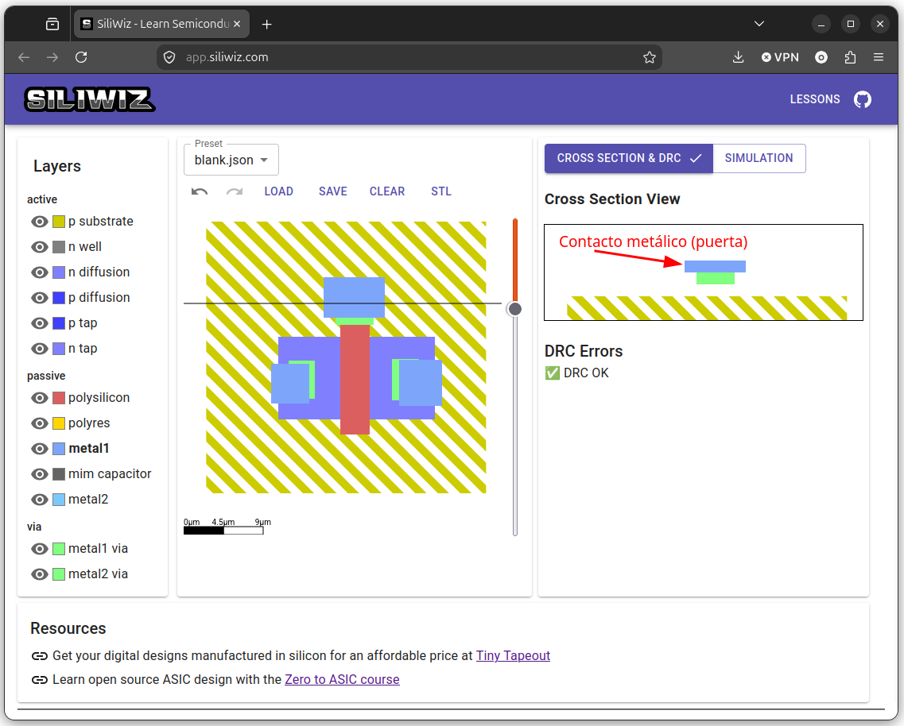  

# Colocando las etiquetas

Lo siguiente es **identificar** los contactos asignándoles un **nombre** a través de una **etiqueta**. Vamos a colocar las etiquetas para establecer las conexiones con **las alimentaciones**. Así, asignaremos la **fuente** a **vss** (0v), el **drenador** a **vdd** (1.8v) y la **puerta** a **in**. La etiqueta **in** es la que utilizaremos para introducir la tensión de entrada para simular el MOSFET N

Primero vamos a conectar **la fuente**. Pinchamos con el **botón izquierdo** del ratón sobre el contacto metálico de la fuente. Aparece un menú. Pinchamos en **Set Label**

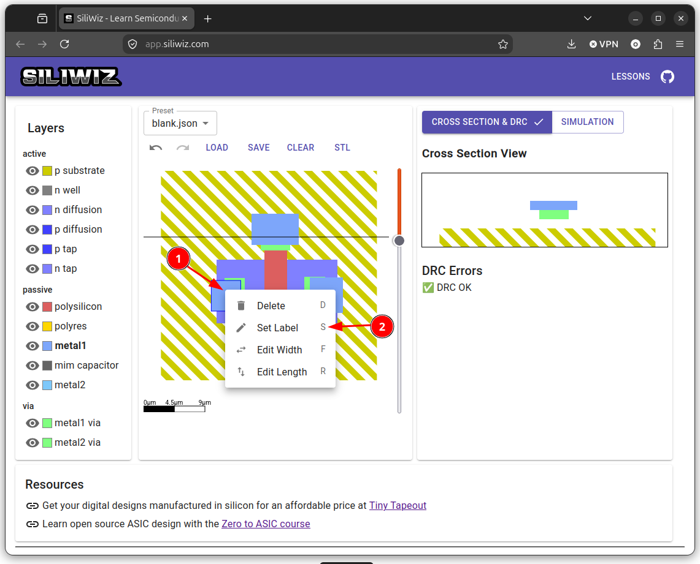  

Aparece un diálogo donde escribimos `vss` y pinchamos en OK

  

Vemos que aparece el texto **vss** en la fuente

  

Repetimos el mismo proceso para el drenador y la puerta. Así es como queda

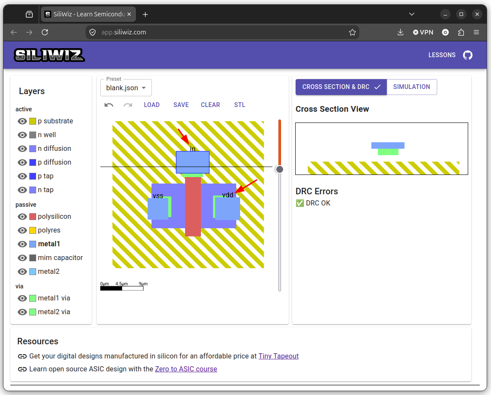  

# Conexión del sustrato a vss

Para terminar el transistor, hay que conectar el **sustrato p** a la tensión `vss`, es decir, a **gnd**. Para realizar esta conexión primero hay que colocar una zona **p tap**. Pinchamos en la capa **p tap** y la colocamos

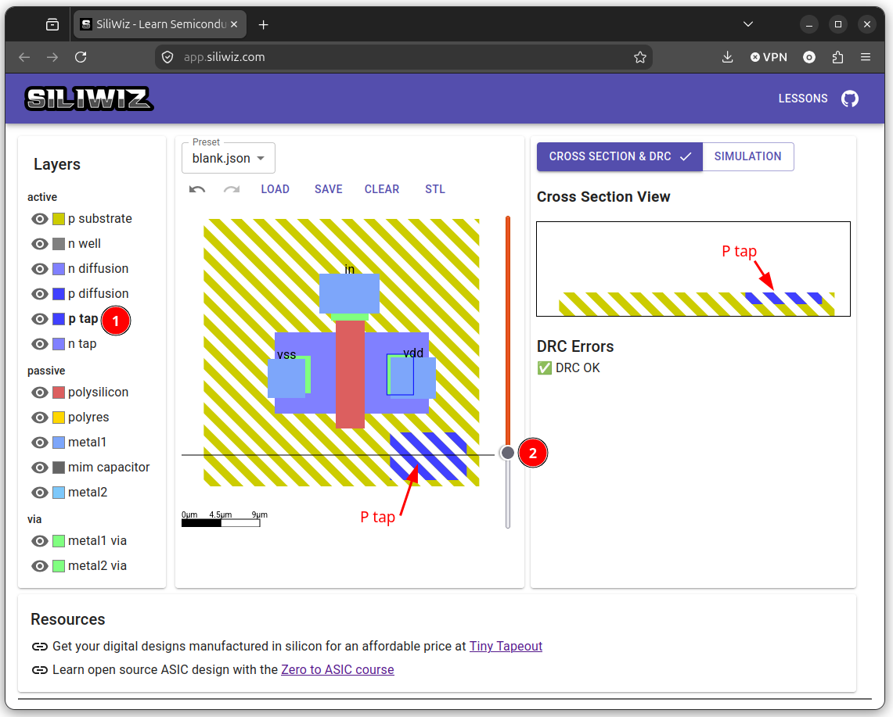  

Ahora colocamos la **vía**

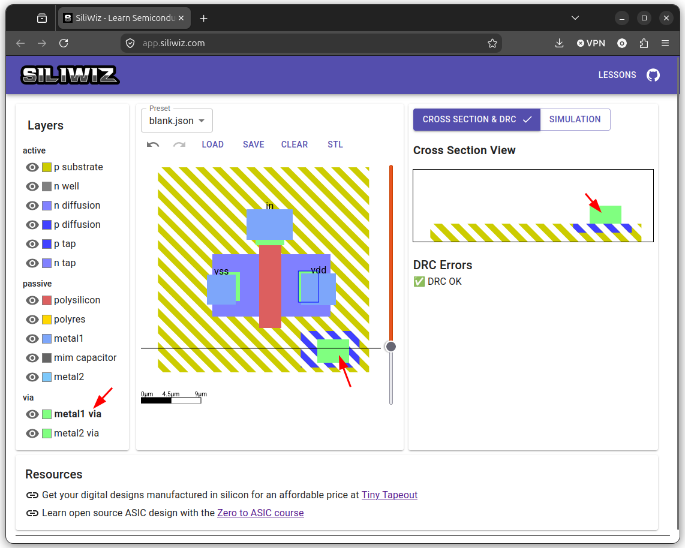  

A continuación el **contacto metálico**

  

Y por último ponemos la **etiqueta** para conectarlo a `vss`

  

¡¡Ya tenemos el MOSFET finalizado!!

# Simulando el mosfet

Vamos a simular el MOSFET. Pinchamos en el botón que pone **SIMULATION**

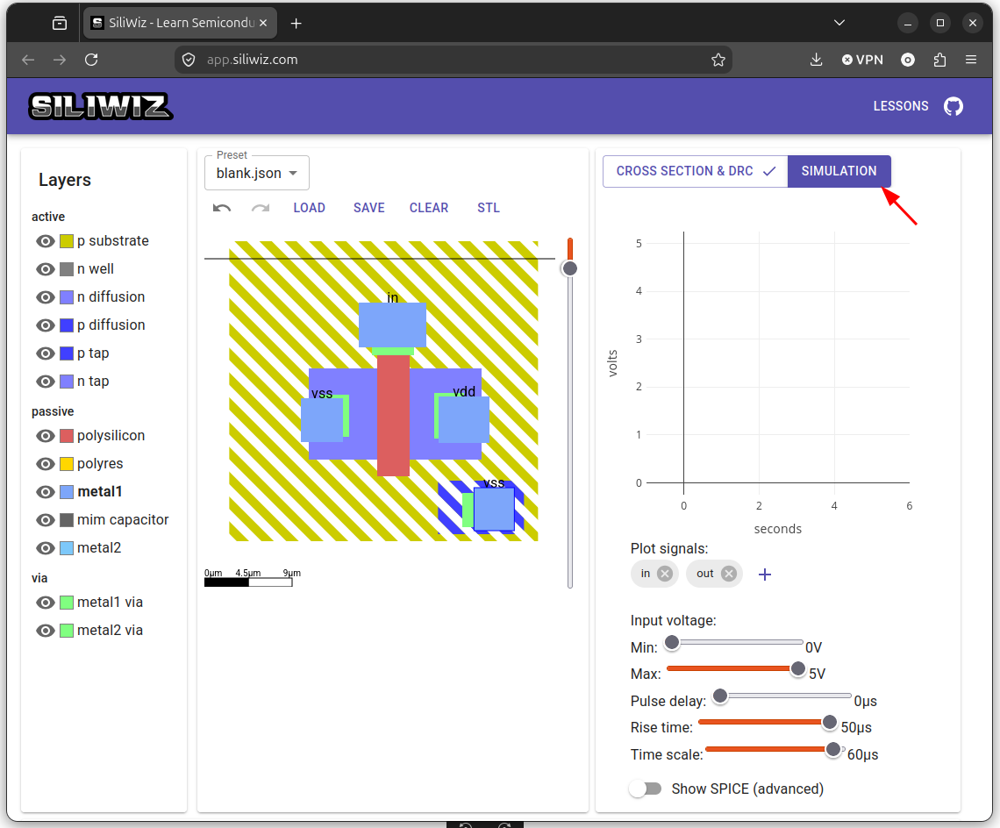  

De momento no aparece ninguna gráfica. Lo que queremos medir es **la corriente** que atraviesa **el drenador**, que en notación de spice se escribe como `i(vdd)`. Primero eliminamos la etiqueta `out`

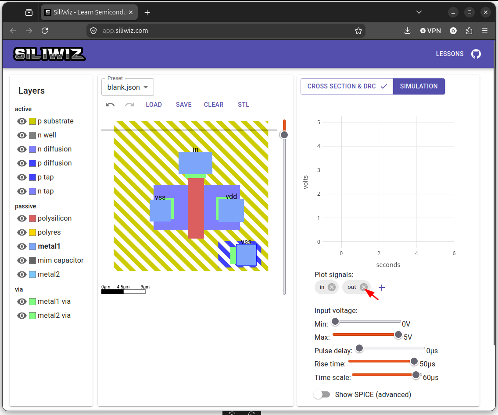  

Al hacerlo se refresca la gráfica y se pinta la señal de entrada `in`, que es la que se introduce por la puerta. Se trata de una **rampa de tensión** que va desde **0** hasta **5v**

  

Queremos que se dibuje **la corriente que atraviesa el drenador**. Pinchamos en el botón **+** para añadirla

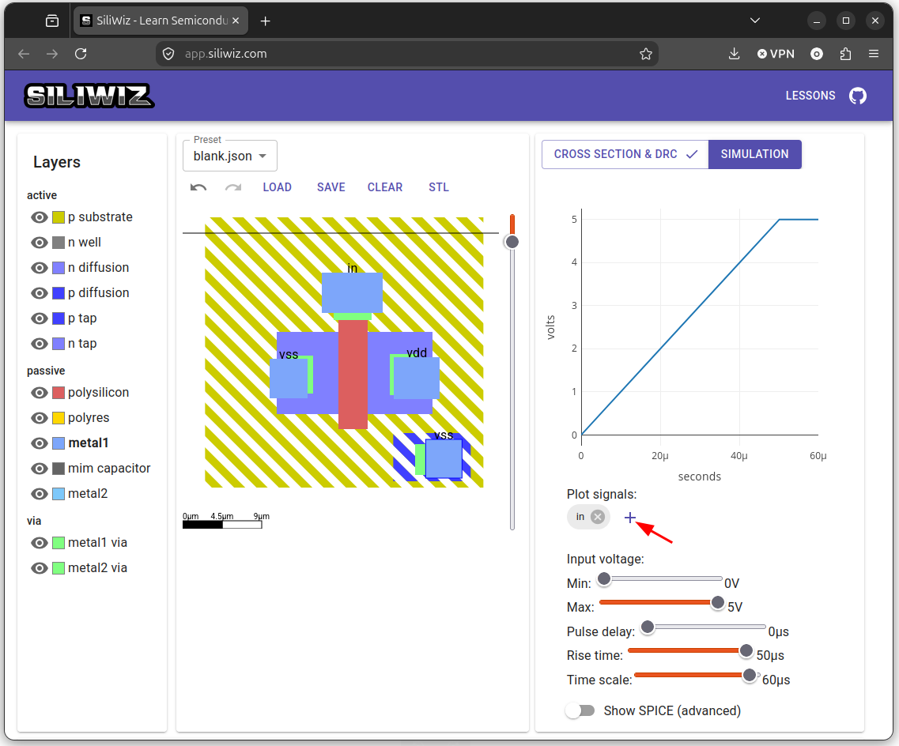  

Aparece un panel de entrada donde escribirmos $i(vdd)*-1000$ y pulsamos **OK**. Lo que queremos que se dibuje es **la corriente** que circula por el drenador, que se denota como $i(vdd)$. Esa corriente **la multiplicamos por -1000** para que tenga signo positivo por un lado (sólo se pueden dibujar corrientes positivas en la herramienta de simulación) y para escalarla y que se vea junto con la tensión de entrada

  

En la gráfica aparece la corriente, en color naranja

  

Comprobamos que cuando la tensión de la puerta es 0, NO hay corriente. Y cuando la tensión es de 5v, se tiene la corriente máxima. Es decir, que funciona correctamente **como un interruptor**: conduce o no conduce según que la entrada sea `1` ó `0`

¡¡El mosfet funciona!!

# Guardando el diseño

El diseño creado, que hemos visto que funciona, lo vamos a guardar en un **fichero local**. Para ello pinchamos en el **botón de SAVE**

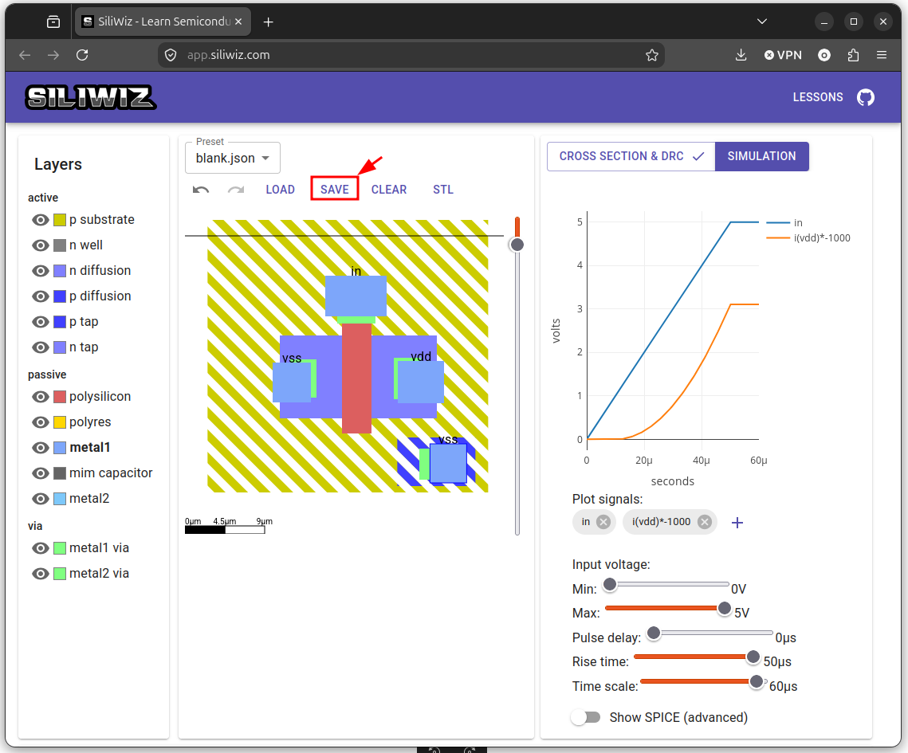  

Automáticamente se empieza a descargar el fichero `siliwiz-design.json`

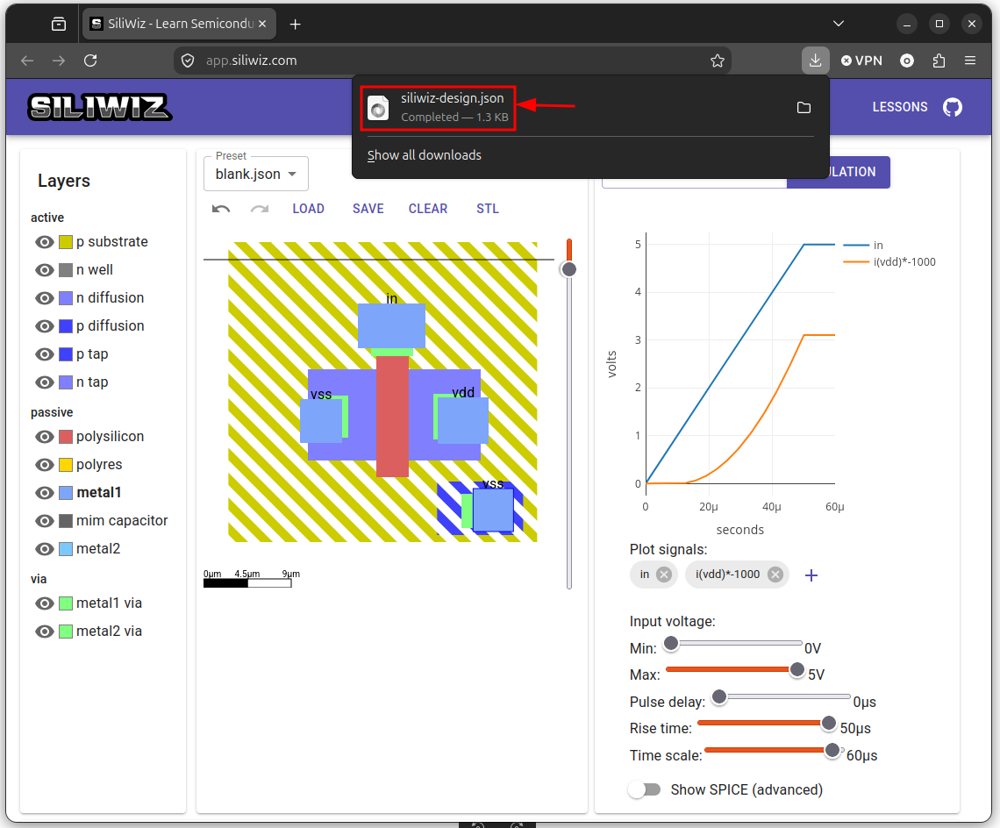  

Este es el contenido del fichero creado

* [mosfet-n.json](https://github.com/Obijuan/Learn-open-silicon/raw/refs/heads/main/wiki/Siliwiz/examples/mosfet-n.json)  

```json
{
  "version": 1,
  "app": "siliwiz",
  "timestamp": 1787478891,
  "rects": [
    { "x": 28.35, "y": 6, "height": 342, "width": 352, "layer": "p substrate" },
    { "x": 119.35, "y": 151, "height": 104, "width": 197, "layer": "n diffusion" },
    { "x": 266.35, "y": 279, "height": 61, "width": 98, "layer": "p tap" },
    { "x": 197.35, "y": 116, "height": 158, "width": 37, "layer": "polysilicon" },
    { "x": 191.35, "y": 102, "height": 34, "width": 48, "layer": "metal1 via" },
    { "x": 132.35, "y": 181, "height": 48, "width": 33, "layer": "metal1 via" },
    { "x": 262.35, "y": 179, "height": 52, "width": 34, "layer": "metal1 via" },
    { "x": 294.35, "y": 293, "height": 39, "width": 53, "layer": "metal1 via" },
    { "x": 176.35, "y": 76, "height": 51, "width": 77, "layer": "metal1", "label": "in" },
    { "x": 110.35, "y": 185, "height": 50, "width": 48, "layer": "metal1", "label": "vss" },
    { "x": 267.35, "y": 183, "height": 53, "width": 58, "layer": "metal1", "label": "vdd" },
    { "x": 307.35, "y": 287, "height": 49, "width": 46, "layer": "metal1", "label": "vss" }
  ],
  "graph": {
    "dcSweep": false,
    "minInVoltage": 0,
    "maxInVoltage": 5,
    "pulseDelay": 0,
    "riseTime": 50,
    "signalNames": "in i(vdd)*-1000",
    "tranTime": 60000000
  }
}
```

# Cargando un diseño

Por supuesto también podemos cargar un fichero grabado previamente. Partimos del estado inicial de Siliwiz, abriéndolo en una nueva pestaña. Aparece el diseño del inversor

Pinchamos en el **botón LOAD**

  

Nos aparece la ventana del navegador para seleccionar el fichero a subir. Elegimos el que habíamos guardado anteriormente, que lo hemos renombrado a `mosfet-n.json`

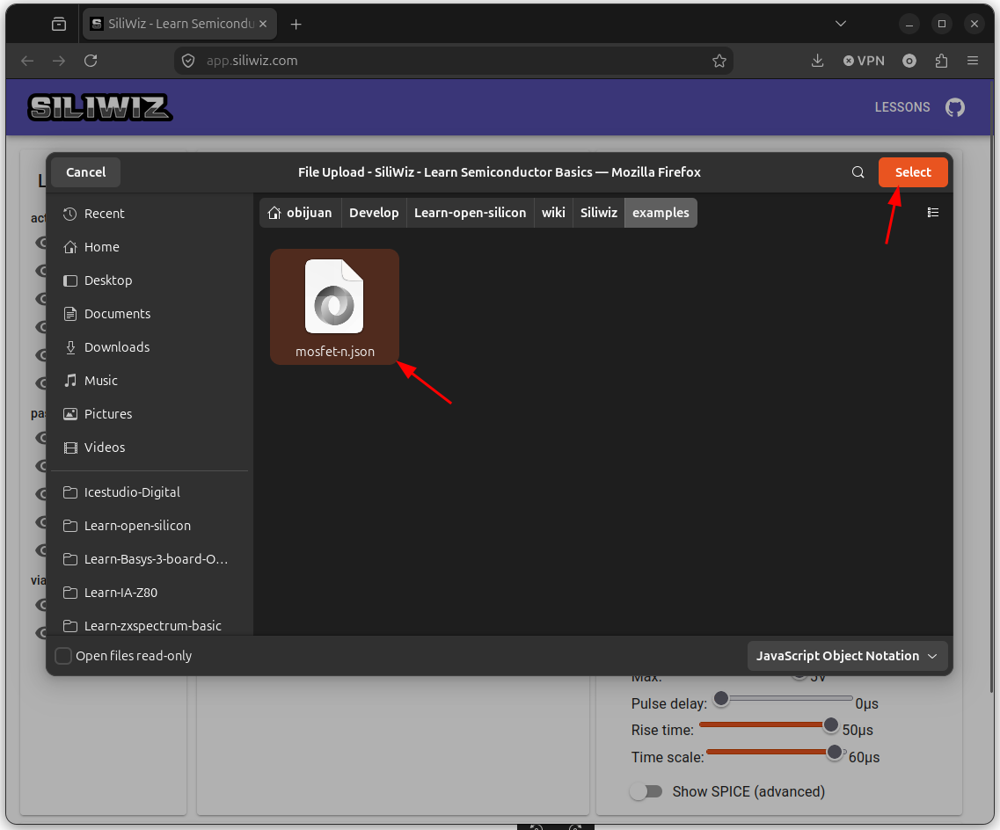  

Se carga el nuevo diseño y se muestra su simulación

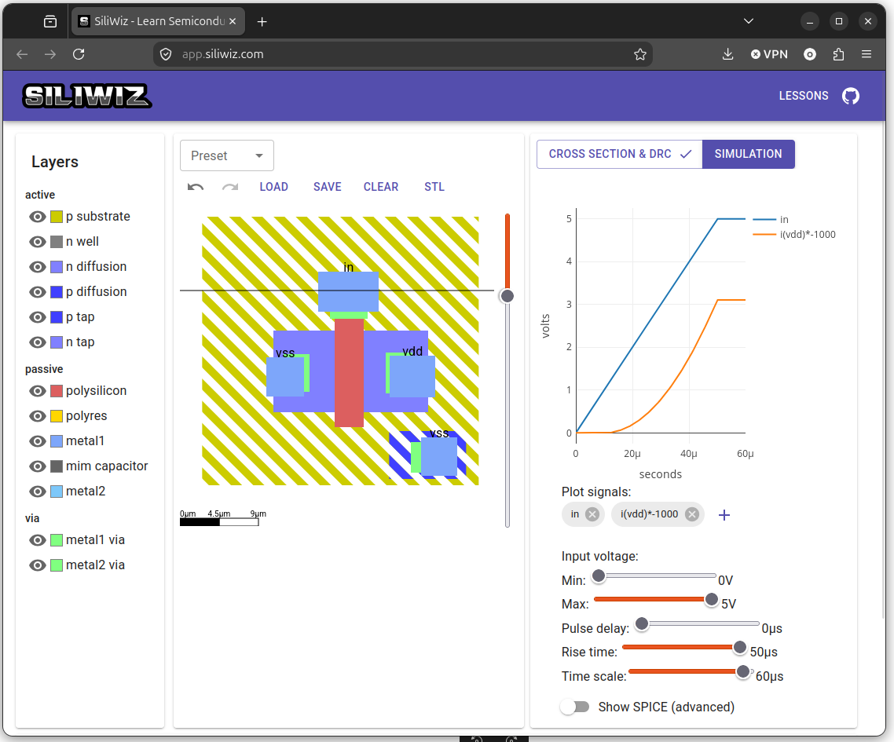  

# Modificando el diseño

Lo interesante de la simulación es que nos permite profundizar en qué parámetros del transistor afectan a su funcionamiento. En el diseño actual vemos que la corriente que circula por el drenador es de **3mA** (En la gráfica vemos 3, pero recordemos que es el resultado de multiplicar el valor real por 1000)

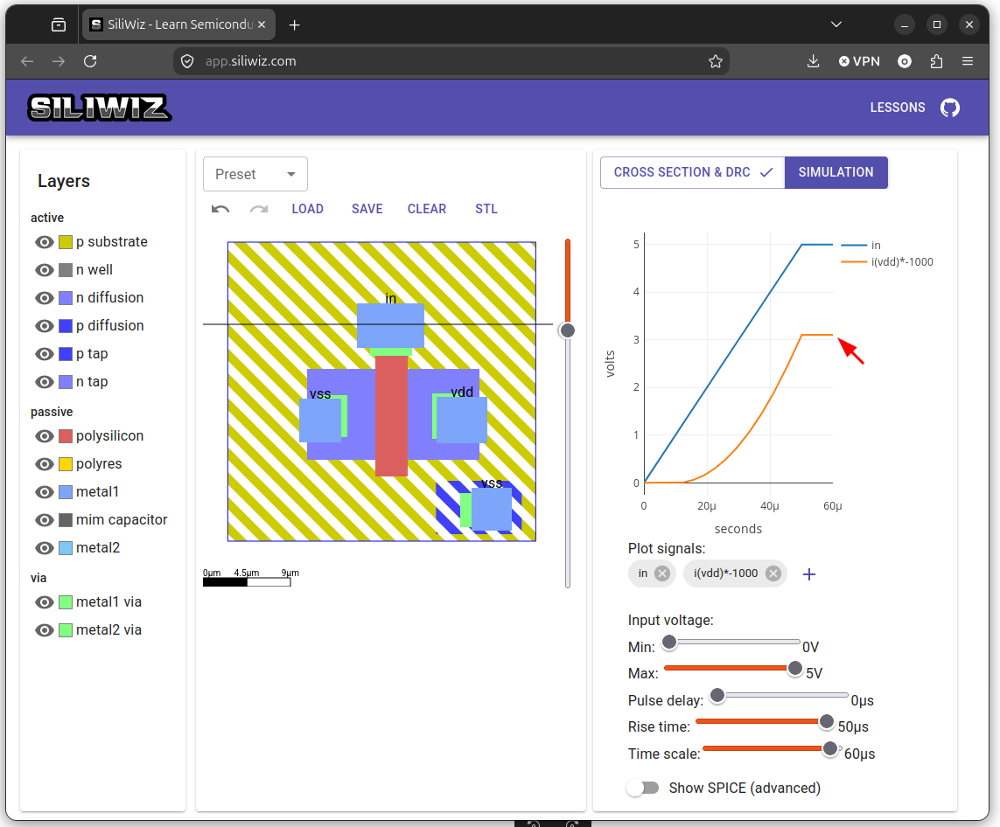  

Vamos a modificar la **longitud del canal N del mosfet**, esto es, cambiando **la anchura del polisilio**. El objetivo es ver cómo afecta esta anchura a la corriente que pasa por el drenador

Lo podemos hacer de dos maneras:

1. **Borrando el polisilicio**, y dibujando uno nuevo. Para borrar pinchamos en el polisilicio con el **botón izquierdo** del ratón y luego seleccionamos **Delete**. Tras ello volvemos a dibujar el polisilicio como ya sabemos

2. **Cambiando la anchura del polisilicio**. Es la opción que vamos a utilizar. Pinchamos con el **botón izquierdo** en el polisilicio

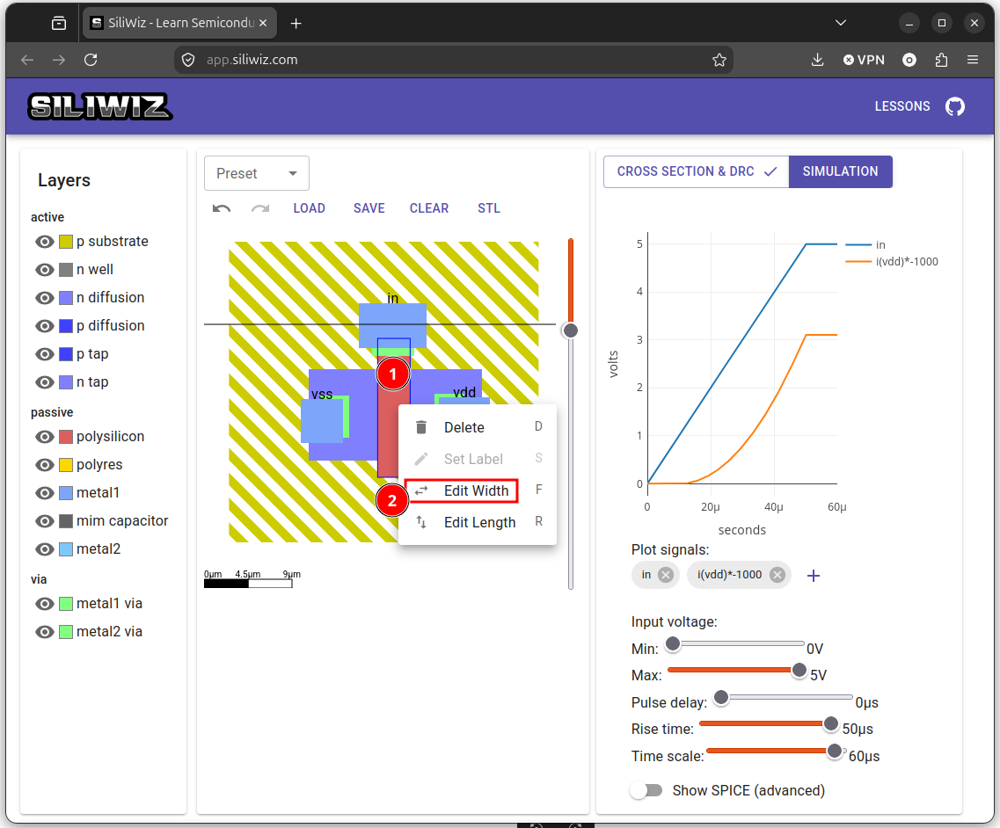  

Vemos el valor de la anchura actual, que en este ejemplo era de **3.3**

  

Vamos a poner un ancho menor, como por ejemplo **2.5**

  

Pulsamos OK. Cambia la longitud del canal (que es la anchura del polisilicio) y vemos en la simulación cómo **la corriente ha aumentado hasta 4mA**

  

# Visualizando el modelo en 3D

Desde Siliwiz exportamos el **modelo 3D** en **formato STL**, que luego podemos editar con herramientas como **Blender** o **FreeCad**, así como imprimir en 3D

## Exportando a STL

Para exportar el diseño actual al formato STL pinchamos en el **botón STL**

  

Se descarga el fichero `siliwiz.stl`

  

Lo renombramos a `mosfet-n.stl`. Ya lo tenemos listo para importar en cualquiera de los programas de diseño 3D 

## Usando Freecad

Desde [FreeCAD](https://www.freecad.org) podemos visualizar el modelo 3D. Sin embargo, el formato STL NO incluye colores, por lo que lo veremos todo en **tonos grises**. Aprovecharemos este apartado no sólo para importar el STL y verlo en gris, sino para convertir todos sus componentes a **objetos sólidos** de FreeCAD, para tenerlos por separados y poder moverlos, editarlos y cambiar sus colores

### Importando el STL

Para Importar el fichero **STL** desde Freecad pinchamos en **File/Open**

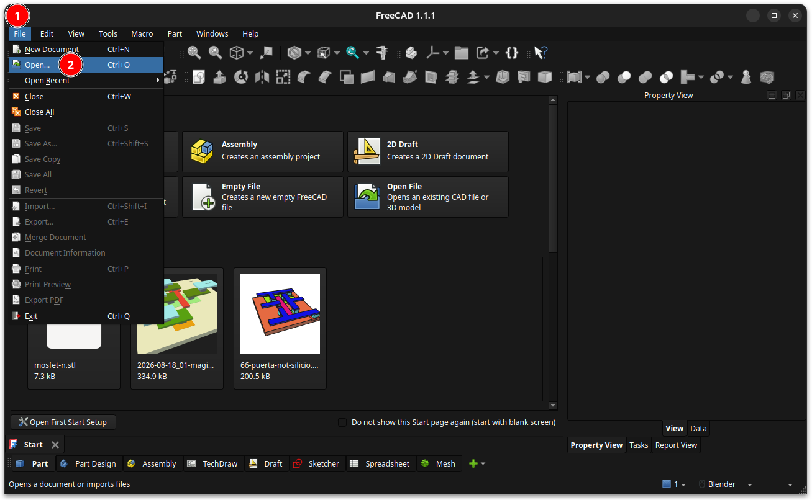  

Seleccionamos el archivo **mosfet-n.stl** y pulsamos **Open**

  

El fichero **STL** se abre, y esto es lo que vemos

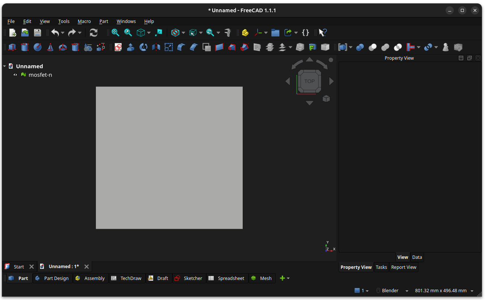  

Como lo que se muestra es la **vista superior**, y el formato STL no permite definir colores, sólo vemos la parte superior del sustrato y no se aprecian el resto de capas. Para verlas mejor hay que **rotar** el diseño, y así lo vemos en un **tono de grises**

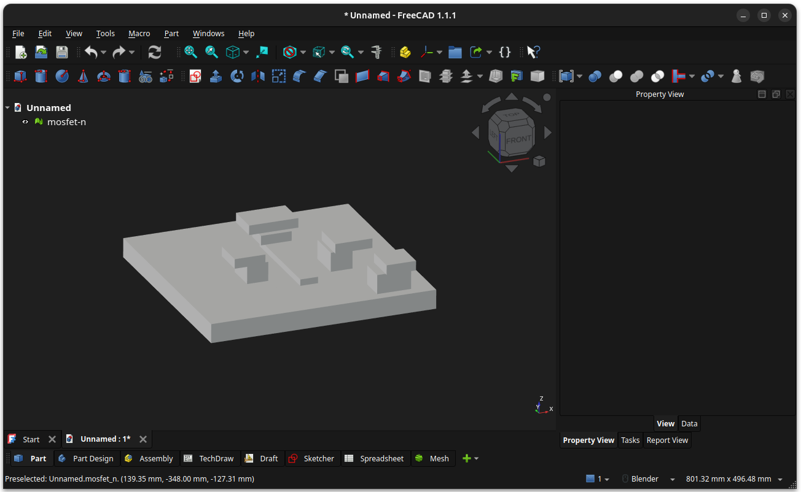  

Vamos a cambiar el modo de ver el STL, para apreciar todas las **mallas**, ya que STL es un **formato de Mallas** (no define sólidos, sino superficies constituidas a partir de triángulos). Seleccionamos el objeto **mosfet-n** en la izquierda, luego nos vamos a la ventana de propiedades (Property view) y seleccionamos la pestaña de **View**. Dentro de ella cambiamos la propiedad **Display Mode** a **Flat Lines**

  

Esto es lo que vemos cuando el objeto deja de estar seleccionado

  

Ahora además de las **cajas** que forman las diferentes zonas del diseño vemos los **triángulos** que las forman. Es la típica vista de mallas

### Guardando en formato FreeCad

Antes de pasar a editar el STL, guardamos el diseño en formato nativo de FreeCAD, con el nombre **mosfet.FCStd**. Pinchamos en **File/Save as**

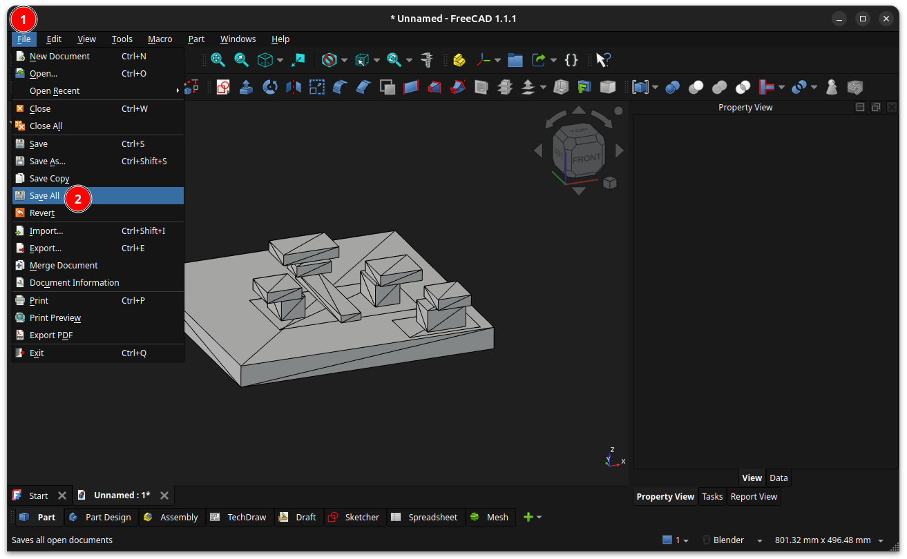  

Escribimos el nuevo nombre y le damos a **Save**

  

Ahora nos aparece el nombre del diseño dentro de FreeCad

  

¡Ya está todo listo para empezar a editarlo! (si es que queremos...)

### Separando los componentes

Lo que vemos es **un único objeto**, pero nosotros sabemos que en realidad está formado por componentes independientes, que son las diferentes cajas. Queremos obtener esas cajas como **objetos aislados**, para tratarlos individualmente. Esto lo hacemos desde el **banco de trabajo mesh**

Nos vamos al banco de trabajo mesh. Esto depende de cómo tengas configura Freecad. Yo en mi caso lo tengo accesible en un botón inferior, pero también se puede acceder en el menú **View/Workbench/Mesh**. Luego seleccionamos el objeto **mosfet-n** y pinchamos en el icono correspondiente a la opción **Split by components**, que también está accesible desde el menú **Meshes/Split by components**

  

Además del objeto original **mosfet-n**, que sigue estando, han aparecido **12 componentes nuevos**

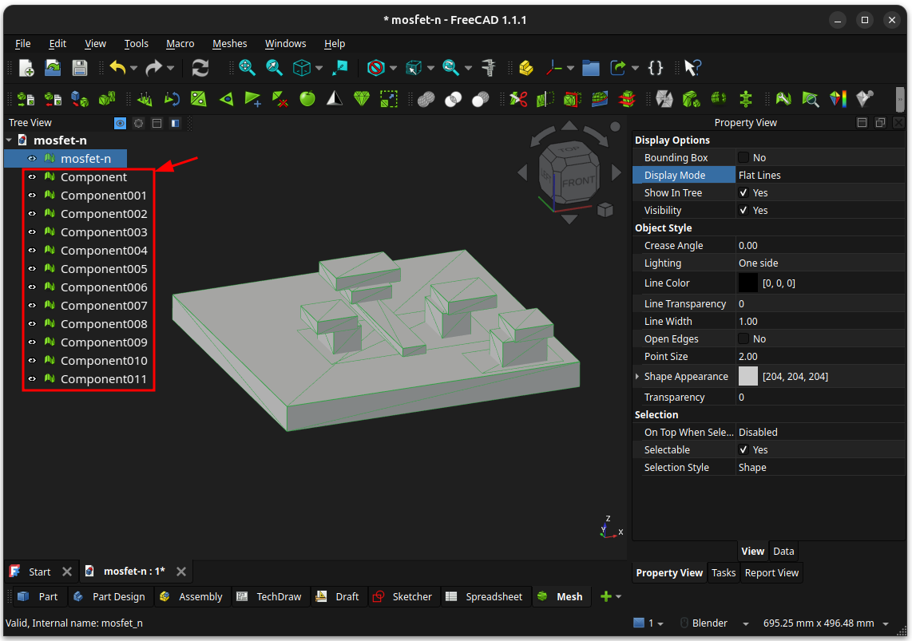  

El objeto **mosfet-n** lo podemos borrar, porque ya no lo necesitamos. Lo seleccionamos y presionamos **supr**

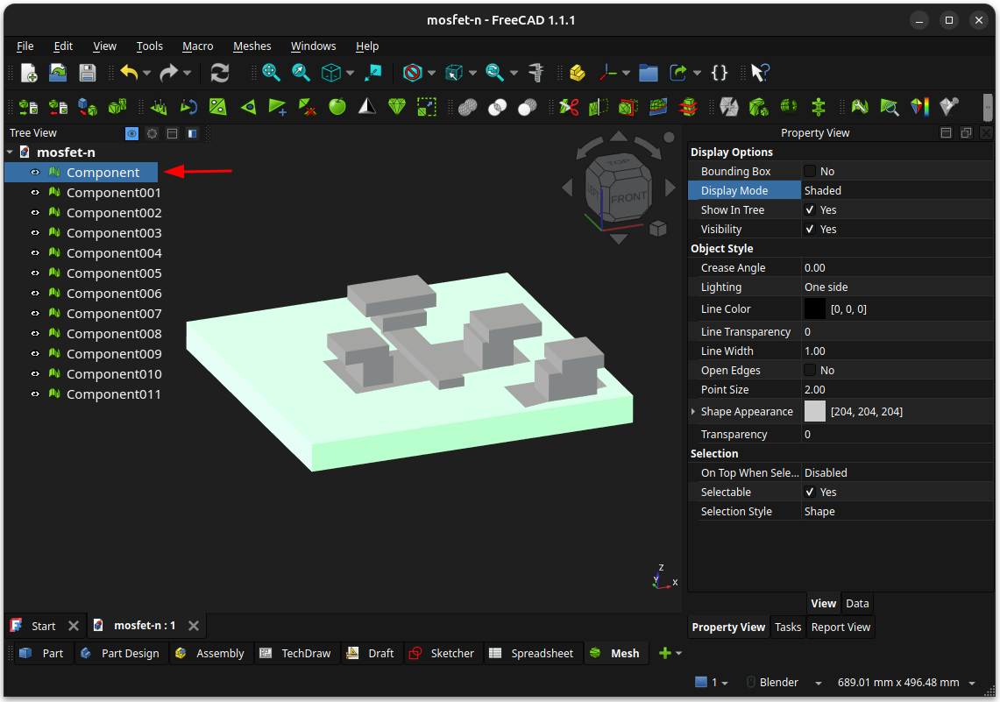  

Se nos selecciona automáticamente el componente que está debajo del que hemos borrado, cuyo nombre es **Component**. Como está seleccionado lo vemos en diferente color que el resto. ¡Se trata del sustrato!

Como experimento vamos a **Ocultar el sustrato**, pinchando en el ojo que tiene a su izquierda. El **sustrato desaparece**, pero el resto de componentes siguen ahí. Ahora son objetos independientes

  

### Convirtiendo el sustrato p a objeto sólido

Cada uno de los nuevos componentes los vamos a convertir a un **objeto sólido**, para poder tratarlos como cualquier otro objeto de Freecad, y por así sacar planos, realizar uniones, intersecciones, ediciones de propiedades...

El proceso lo vamos a hacer para TODOS LOS COMPONENTES, sin embargo sólo lo mostraremos para el **sustrato p**, y luego habrá que repetir los mismos pasos para los otros componentes

Lo primero es **cambiar el nombre** para hacerlo más reconocible. Lo cambiamos de **Component** a **sustrato-tmp**. El sufijo **-tmp** lo usamos para indicar que es un componente **temporal**, que luego borraremos cuando tengamos el final. El nombre se **cambia** fácilmente pulsando en el nombre del componente con el **botón derecho** y usando la opción **rename**. El resto de componentes los ocultamos para no generar ruido

  

El **sustrato p** es una malla. Vamos a cambiar sus propiedades, como ya sabemos, para ver todos los triángulos

  

El primer paso es convertirlo a una **forma**, que es un objeto de freecad no sólido. Vamos al **banco de trabajo Part** y pinchamos en la opción **Part/Shape from mesh**

  

Nos aparece un cuadro de diálogo. Lo ignoramos, pinchando en **OK**

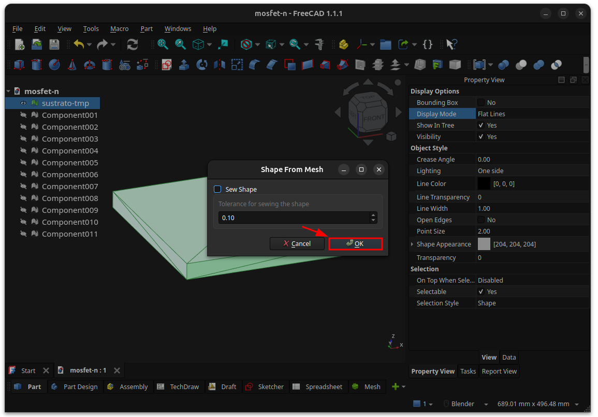  

Aparece un nuevo componente, llamado **Component012**, que es el sustrato p convertido ya a una forma. El objeto original NO desaparece por lo que lo ocultamos

  

Vamos a convertirlo a **un objeto solido** de Freecad. Con este objeto seleccionado pinchamos en **Part/Convert to Solid**

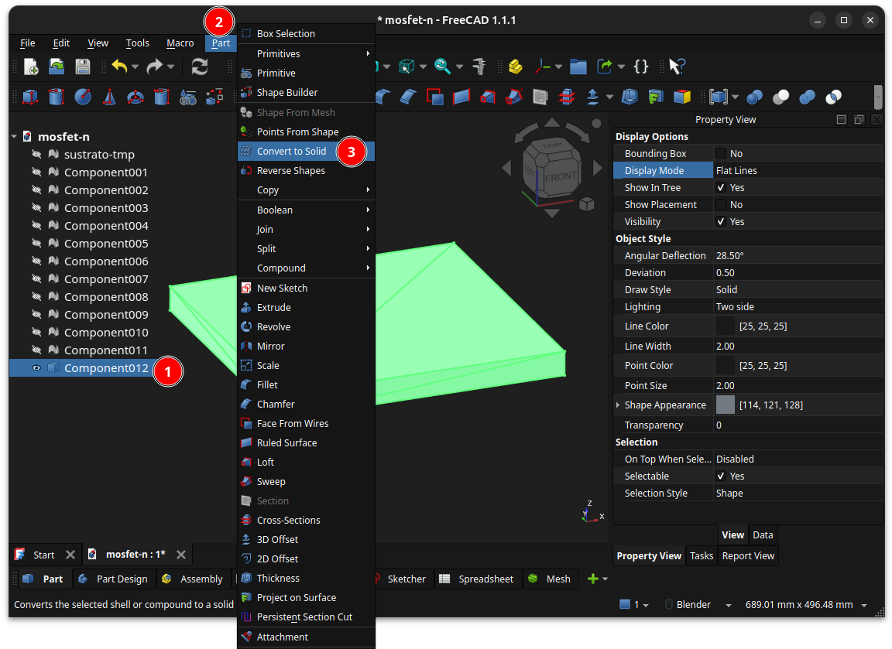  

Nos aparece un nuevo objeto, llamado **Component012 (solid)**, que ya sí que es un objeto de freecad sólido. Es decir, que es macizo en su interior. Aprovechamos para ocultar el anterior **Component012**

  

Se trata de un objeto sólido, pero todavía **se ven los triángulos** que formaban la malla original. Para eliminarlos tenemos que **refinar** el objeto. Lo seleccionamos y pinchamos en **Part/Copy/Refhine Shape**

  

Ahora ya nos aparece un nuevo objeto que no tiene los triángulos: se han refinado, y sólo tiene las caras de la caja

  

Este nuevo objeto creado no es independiente, sino que está asociado al objeto anterior **Component012(Solid)**. Para dejarlo como **un objeto independiente**, creamos **una copia simple**. Lo seleccionamos y pulsamos en **Part/Copy/Simple copy**

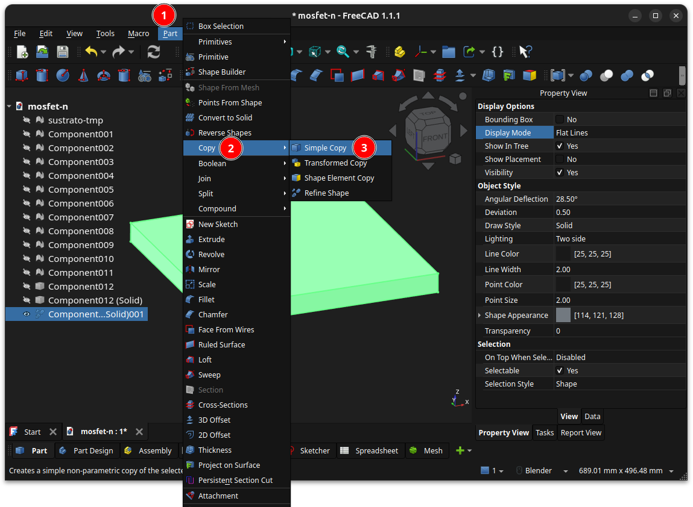  

Nos aparece ya nuestro **objeto final**, independiente de las operaciones anteriores

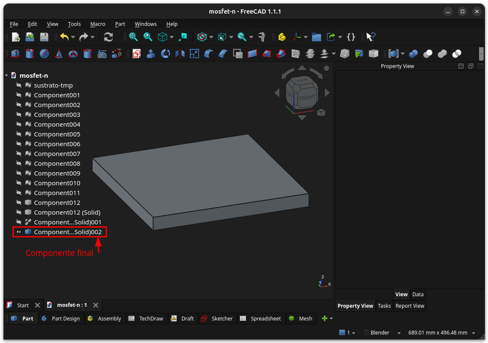  

Ahora hacemos limpieza y **borramos** todos los objetos generados a partir del sustrato original, salvo este último

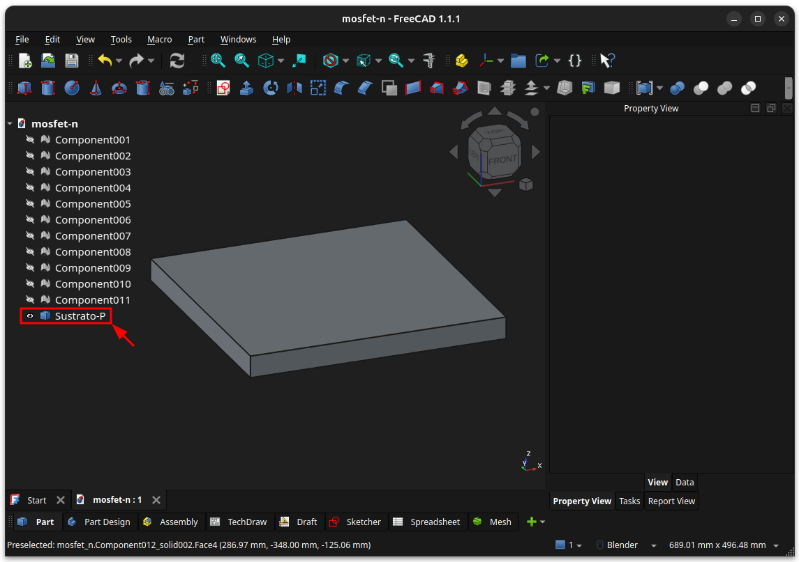  

Por último cambiamos el color. Seleccionamos el objeto y ponemos color amarillo

  

Este es el resultado final. Mostramos todos los objetos

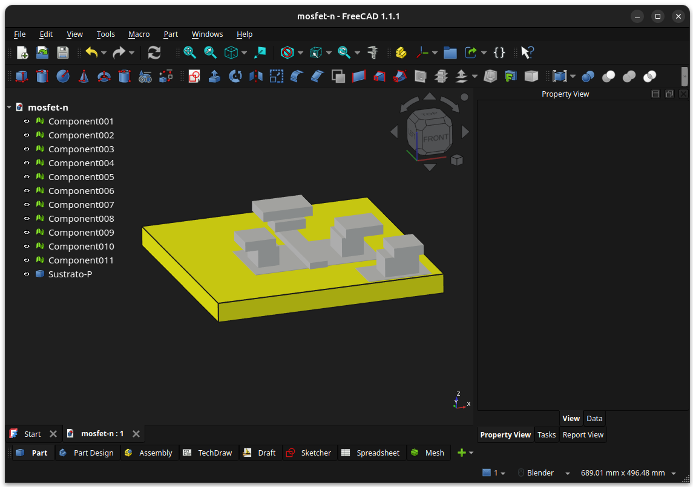  

### Convirtiendo el resto de componentes a objetos sólidos

Hacemos los mismo con el resto de componentes. Resumimos aquí los pasos:

1. **Convertir la malla a forma**. Comando: **Part/Shape from mesh**
2. **Convertirlo a objeto sólido**: Comando: **Part/Convert to Solid**
3. **Refinar el objeto**: Comando: **Part/Copy/Refhine Shape**
4. **Crear una copia simple**: **Part/Copy/Simple copy**
5. **Renombrar el objeto final**
6. **Borrar todos los objetos intermedios** anteriores generados
7. **Cambiar el color**

Así es como queda el **modelo 3D**

  

### Añadiendo texto

Vamos a añadir el texto a los contactos para indicar cuál es cada uno. Pasamos al banco de trabajo **draft**. Como primer ejemplo colocaremos el texto de la fuente: **SOURCE**. Pinchamos sobre la cara superior del contacto metálico de la fuente para seleccionarla y luego pinchamos sobre el **plano de trabajo** para que se nos sitúe encima de ese contacto

  

El plano de trabajo se sitúa encima del contacto de la fuente. Se convierte en un plano de trabajo **custom**

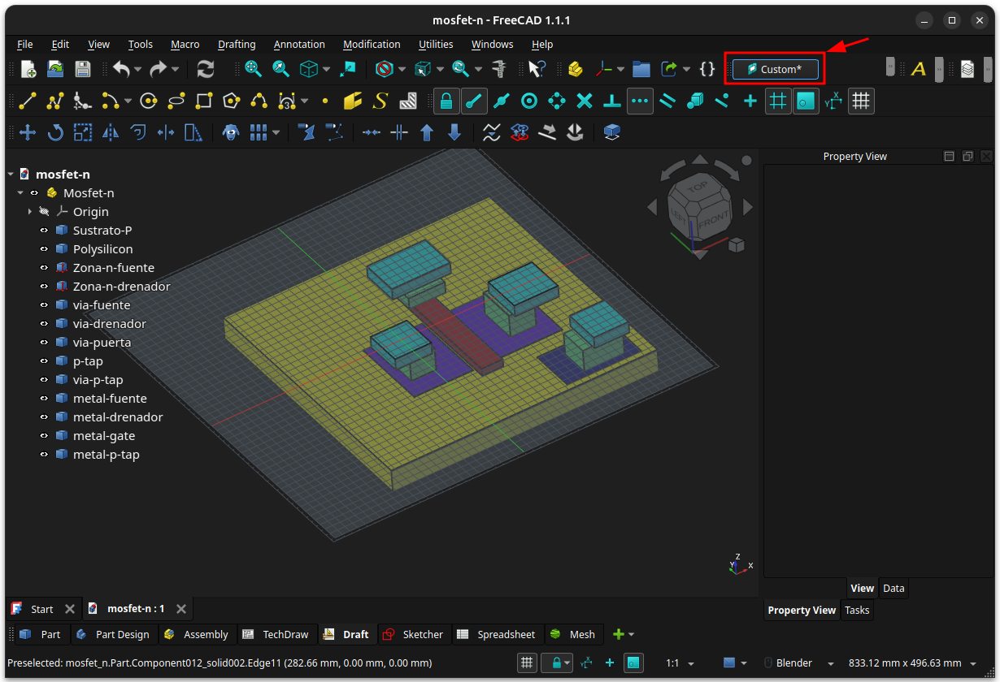  

Pinchamos ahora en el icono **Shape from text**

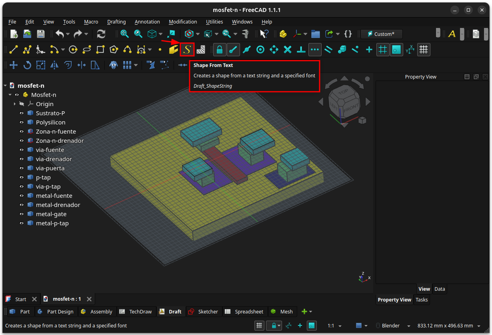  

Se abre un nuevo diálogo en la derecha. Escribimos el texto, `SOURCE`, luego ponemos **el tamaño**, por ejemplo 6, situamos el ratón en la zona de la rejilla donde queremos poner el texto y apretamos el botón izquierdo del ratón. Por último pinchamos en **OK**

  

Nos aparece el texto `SOURCE` sobre el contacto de la fuente

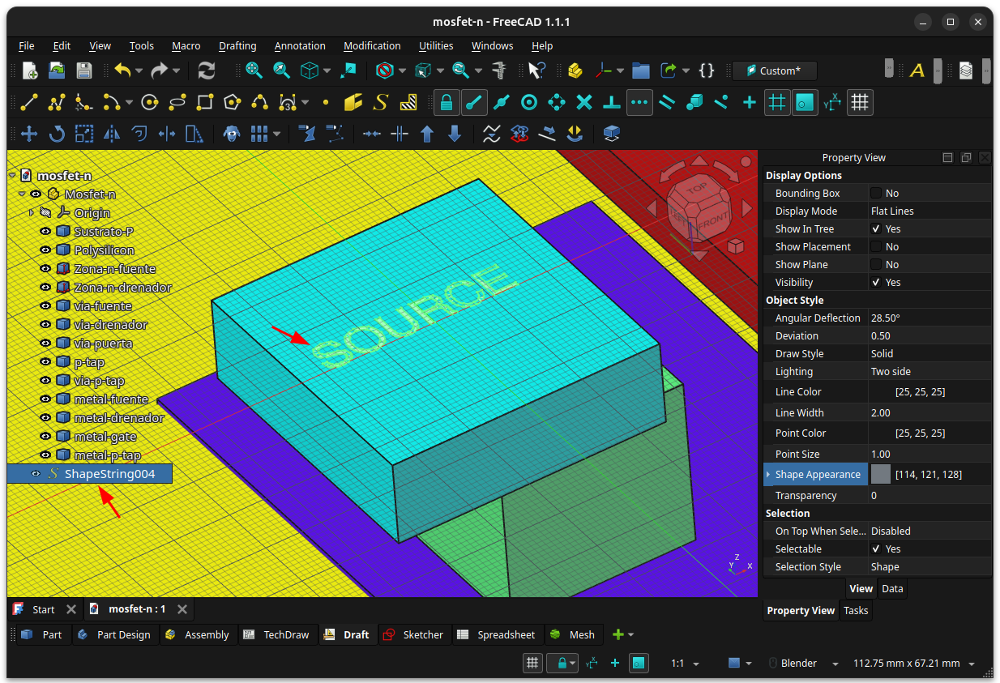  

El texto se pone en el mismo plano que la superficie del contacto. Para que se vea mejor vamos a **subirlo 1 unidad**. Seleccionamos el texto y con el botón derecho damos a la opción de **Transform**. Lo desplazamos 1 en el sentido de **W**. Pinchamos en OK

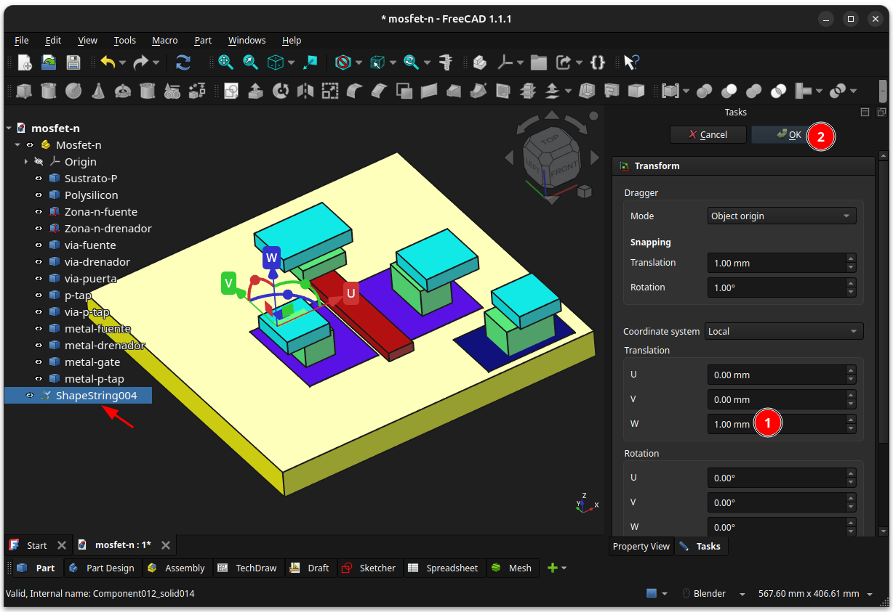  

Así es como se ve el texto

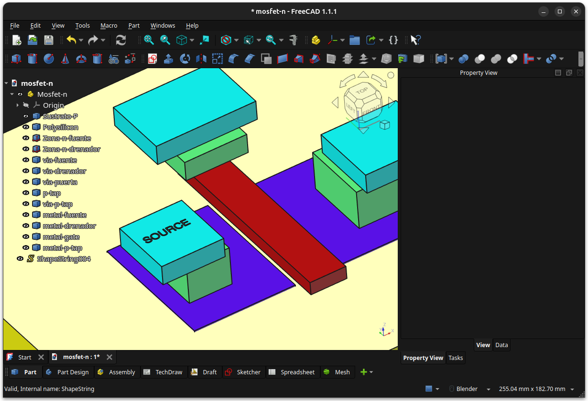  

Cambiamos sus propiedades para que tenga un **color Negro**, y que resalte más, y renombramos el objeto a `label-source`. Esto ya lo sabemos hacer

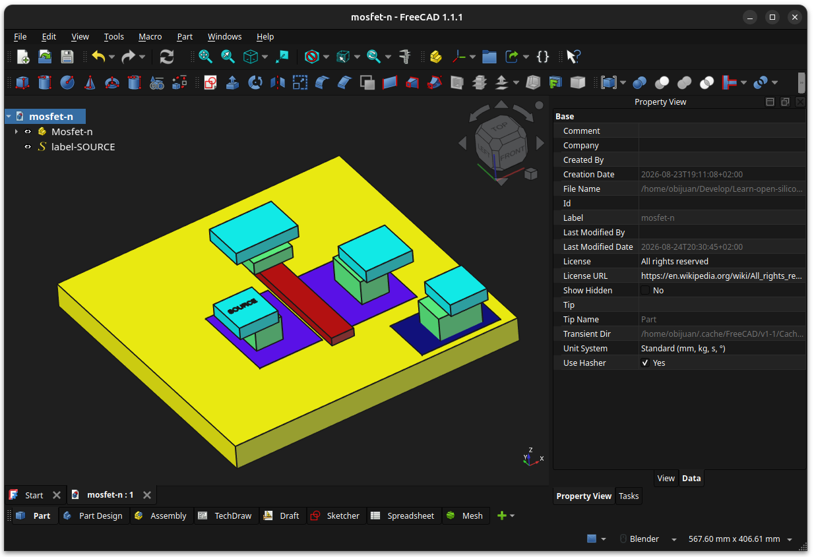  

Repetimos el proceso con el resto de etiquetas

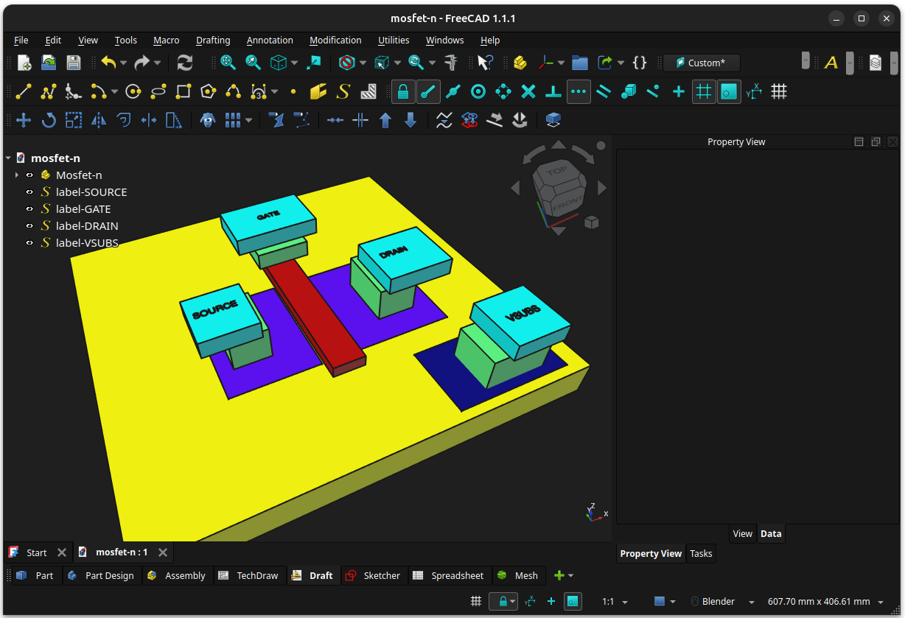  

# Conclusiones

Hemos diseñado nuestro primer **mosfet N** desde 0 utilizando **Siliwiz**. Lo hemos **simulado** y por último lo hemos **exportado a 3D**. Para hacer mejores documentaciones, hemos aprovechado para tener el modelo 3D de manera nativa en **FreeCAD**

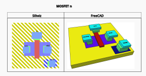  

# Autor
* [Juan González-Gómez](https://obijuan.github.io/) (Obijuan)

# Licencia

[](https://creativecommons.org/licenses/by-sa/4.0/deed.en)  

# Créditos

* Siliwiz es una herramienta creada por Matt Venn
* Para la documentación del tutorial he utilizado información del curso [Zero to asic](https://zerotoasiccourse.com/) y del proyecto [TinyTapeout: ¡Fabrica tus propios chips!](https://tinytapeout.com/)

# Enlaces

* [Matthew Venn](https://zerotoasiccourse.com/matt_venn/)  
* [Zero to asic course](https://zerotoasiccourse.com/)  
* [Aplicación Siliwiz](https://app.siliwiz.com/)  
* [FreeCAD](https://www.freecad.org)  
* [Tecnología sky130](https://github.com/gdsfactory/skywater130)  
* [Introducción a Siliwiz (Inglés)](https://tinytapeout.com/es/siliwiz/introduction/)  
* [Dibujando una resistencia con Siliwiz (Inglés)](https://tinytapeout.com/siliwiz/resistors/)  
* [TinyTapeout: ¡Fabrica tus propios chips!](https://tinytapeout.com/)
