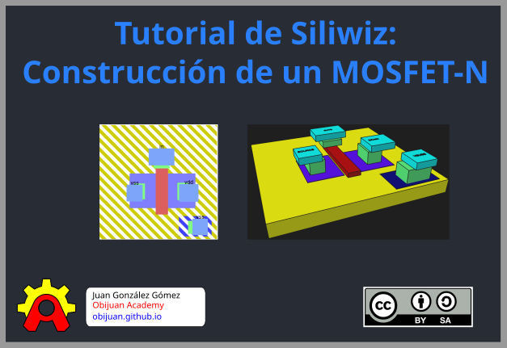
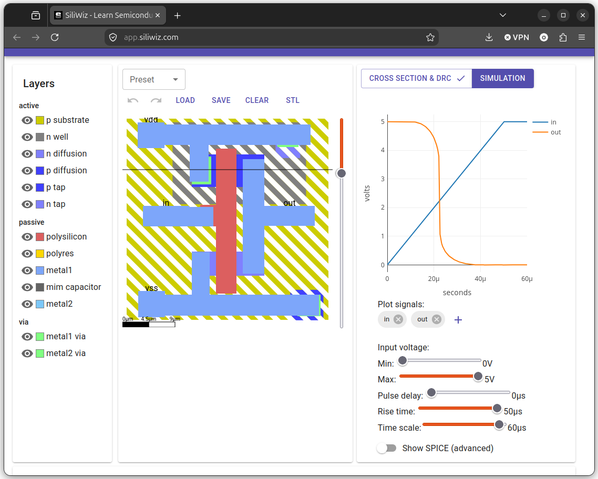

# Introducción

[Siliwiz](https://app.siliwiz.com/) es un programa que corre on-line para aprender los **fundamentos del diseño de chips**, desarrollado por 
[Matt Venn](https://zerotoasiccourse.com/matt_venn/) para su curso [Zero to asic](https://zerotoasiccourse.com/)  

En este tutorial vamos a ver cómo diseñar el **layout** de un transistor **MOSFET-N**, y cómo simularlo. En la parte final exportaremos el MOSFET-N a **formato 3D** y lo reconstruiremos con la herramienta [FreeCAD](https://www.freecad.org), para poder usarlo en nuestras documentaciones

Siliwiz NO es para fabricación, sino sólo para uso educativo. La tecnología que usa es una simplificación de la [sky130](https://github.com/gdsfactory/skywater130)

Esto es lo que aparece cuando entramos en la herramienta

  

¿Por qué utilizar este programa?. Estas son las **ventajas** que tiene

**Ventajas**
  * Es **Software Libre**. Pertenece al **Patrimonio tecnológico de la humanidad**. Código fuente: [Siliwiz en Github](https://github.com/TinyTapeout/siliwiz)  
  * Es **on-line**, y se ejecuta desde el **navegador**. Es multiplataforma y no necesita instalación
  * Muy fácil de utilizar
  * Interfaz moderna
  * Muy buena para aprender los fundamentos
  * Simulación básica de los diseños

¿Para qué **NO** nos vale? ¿Qué limitaciones tiene?

**Desventajas**:
  * Usa una **tecnología ficticia** (es una simplificación de sky130)
  * No es posible generar los ficheros **GDS** para fabricación
  

