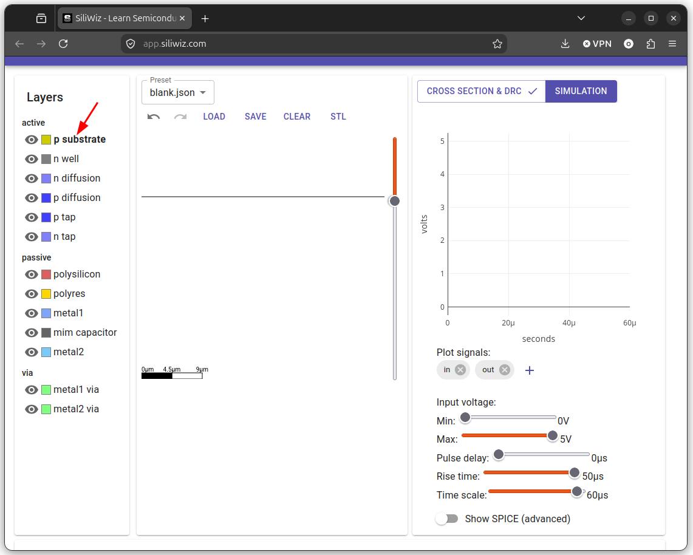
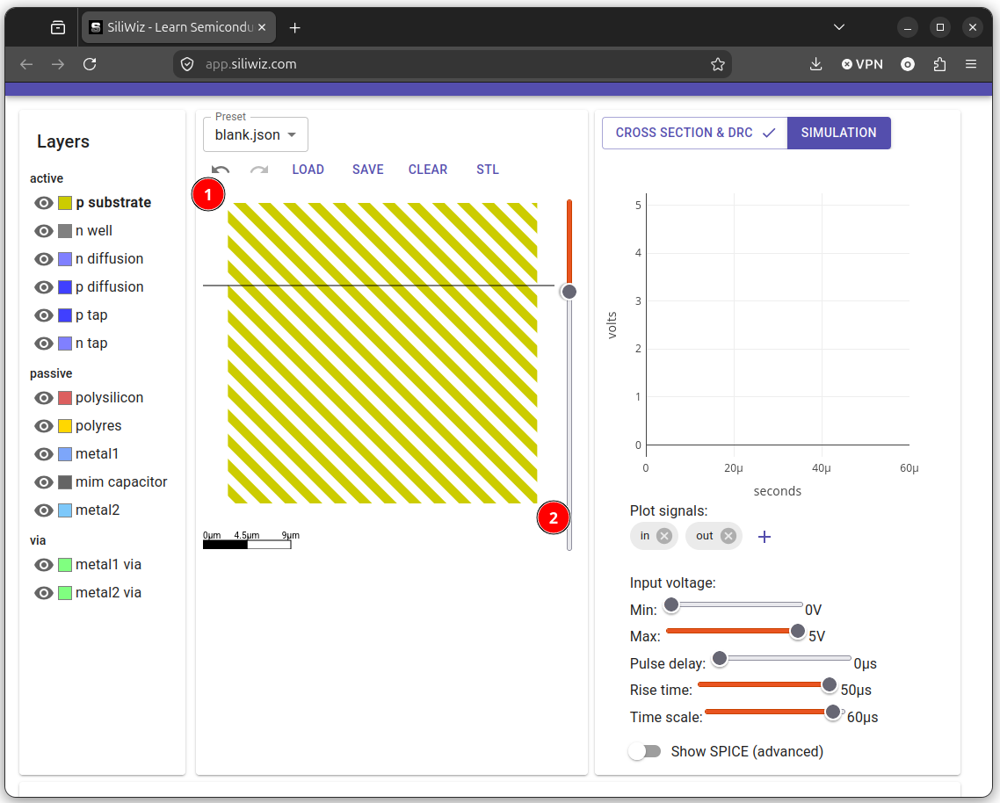
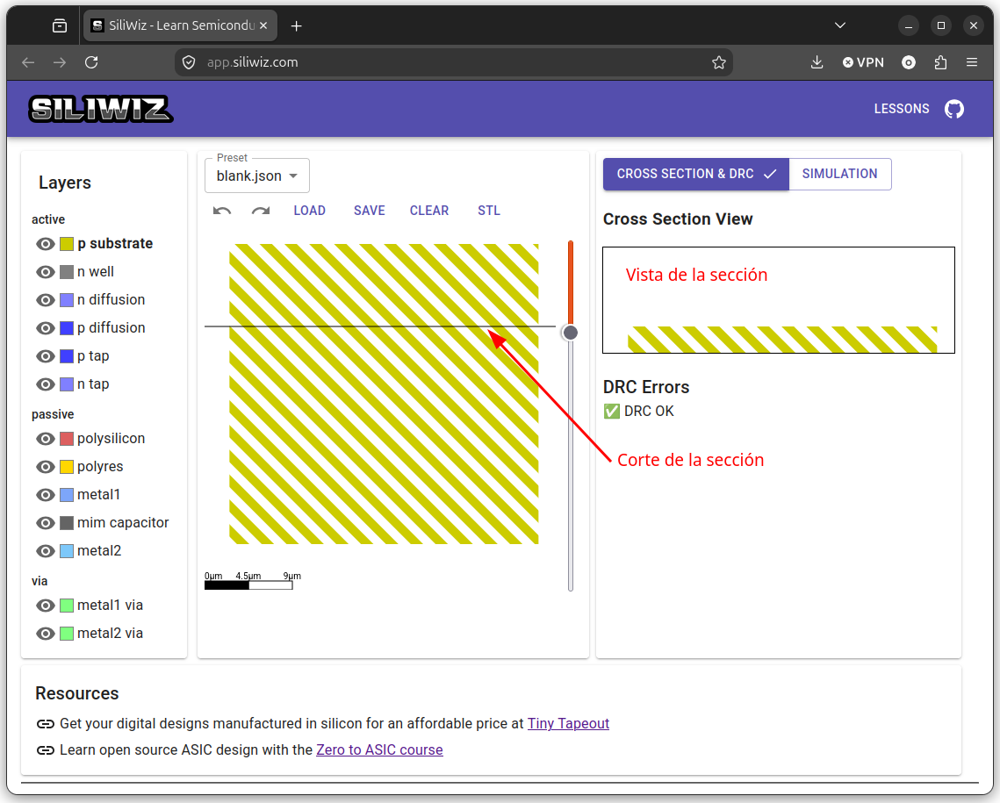

# Colocando el sustrato

El chips está situado sobre **una capa de Silicio tipo P**, que llamamos **sustrato**. Para colocarlo pinchamos en la parte izquierda donde pone **p sustrate**

  

Pinchamos con el **botón izquierdo** del ratón en la **esquina superior izquierda** de la zona donde posicionar el sustrato y **arrastramos** hasta la **esquina inferior derecha**, donde soltamos el botón

  

Todo lo que se dibuja en el layout son **rectángulos**, por lo que el proceso siempre es el mismo. Lo que vemos es **la vista superior** del diseño (la planta). Sabemos que es el sustrato porque tiene un relleno de rayas oblicuas amarillas y blancas

Para ver la altura del sustrato vamos a visualizar la **sección transversal**. Pinchamos en el botón que pone **CROSS SECTION & DRC**

En la parte de la derecha se encuentra la **sección transversal** donde podemos ver la altura del sustrato. La parte superior del plano de corte se muestra en la izquierda, y se puede mover hacia arriba y abajo con **la barra deslizadora** que separa ambos paneles  
