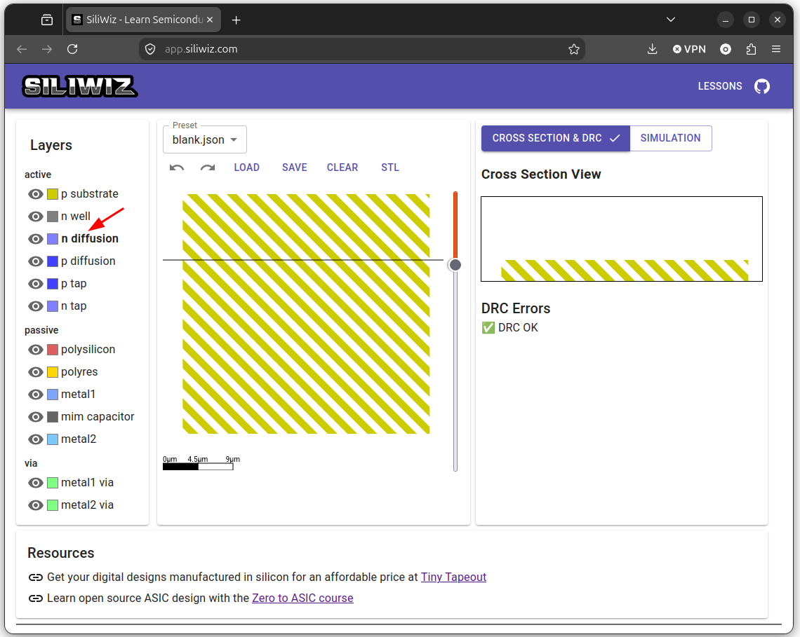
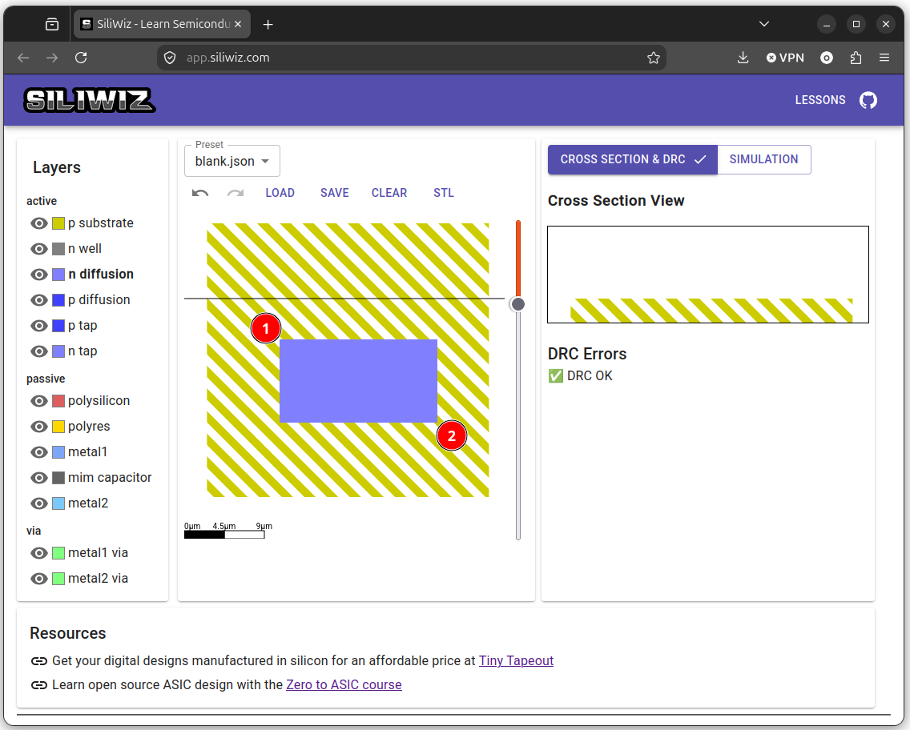
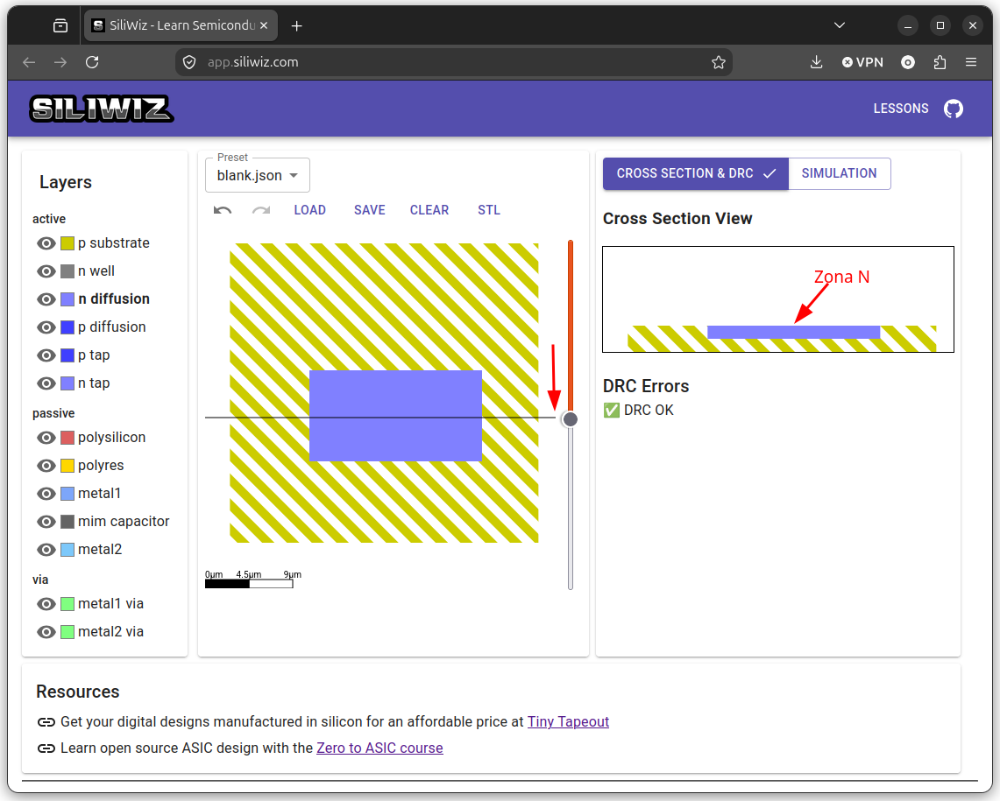

# Silicio tipo N

Lo siguiente es crear la zona de **silicio tipo N** que luego se convertirá en la **fuente** y el **drenador** del MOSFET N. Pinchamos en la capa **n diffusion**

  

Seleccionamos la esquina superior izquierda de la zona N con el **botón izquierdo** del ratón y arrastramos hacia la esquina inferior derecha. Aparece la zona N de color azul

  

Movemos la barra de deslizamiento hacia abajo para atravesar la zona N. En la sección vemos cómo aparece la zona N incrustrada en el sustrato

  

