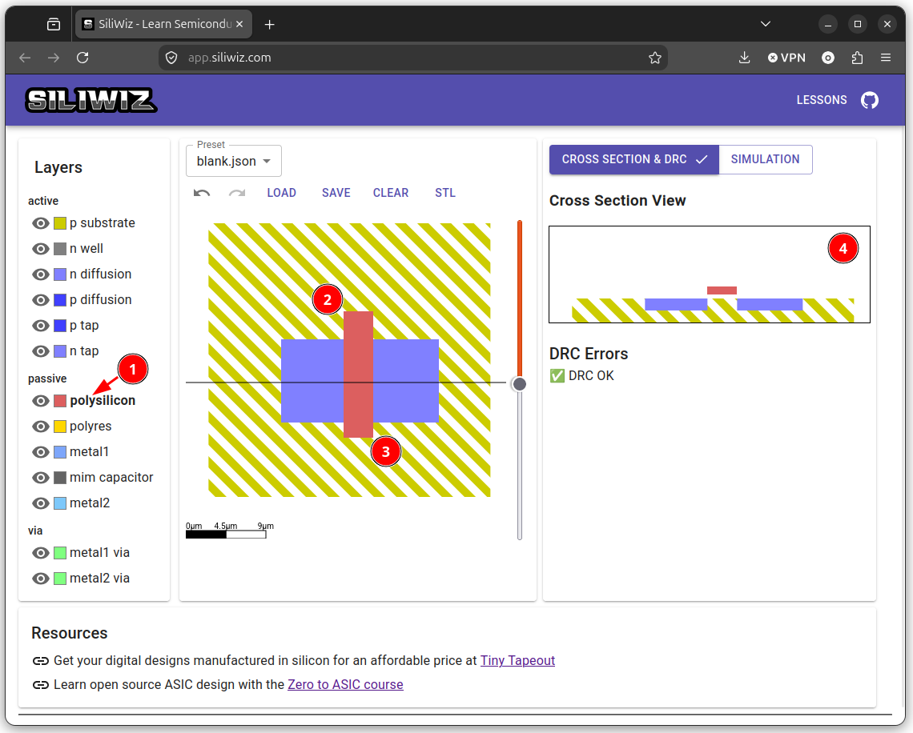

# Colocando el polisilicio

Para crear la puerta utilizamos el **polisilicio**. Seleccionamos la capa **polysilicon** y la colocamos encima de la zona N, atravesándola verticalmente

  

En la sección vemos cómo ahora la herramienta **separa la Zona N en dos**, una para la **fuente** y otra para el **drenador**. Debajo del polisilicio no aparece nada en la sección, pero ahí está situado el **óxido de silicio**

  

También observamos que NO HAY ERRORES DRC. Es decir, que no se están violando las **reglas de diseño** (Tamaños, distancias mínimas, etc...)

¡El transistor ya está listo! Ahora tenemos que sacar sus terminales (Fuente, drenador y puerta) hacia los contactos metálicos para llevarlos al exterior
