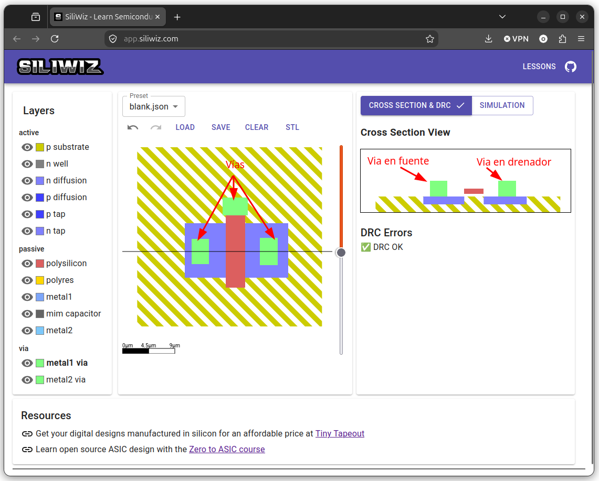
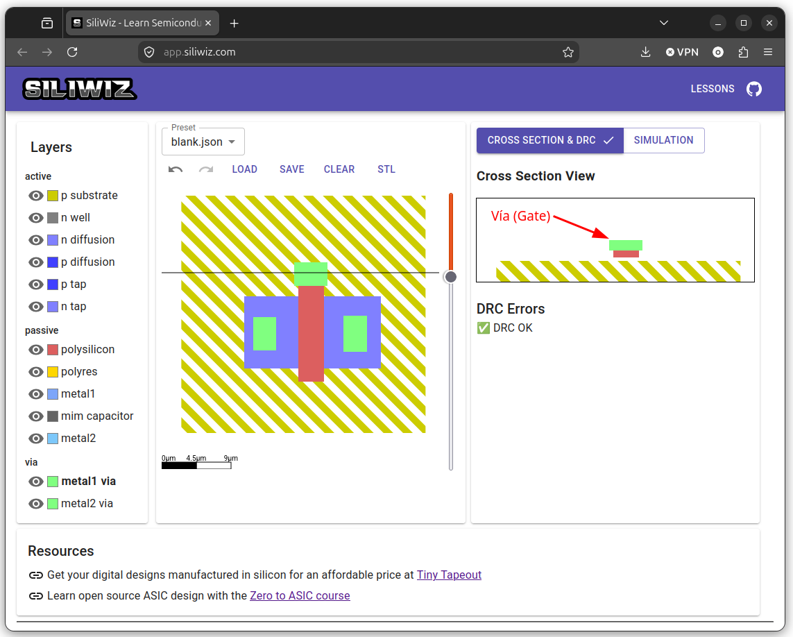

# Colocando las vías

Para realizar la conexión con el exterior primero hay que colocar las **vías**, que nos une la **zona actual** con la capa superior donde estará el **metal**

Para colocar las vías pinchamos en la capa **metal1 via** y las colocamos en contacto con las dos zonas N (Fuente y drenador) y el polisilicio (Puerta)

  

Si movemos la sección hacia la puerta, podemos ver la tercera vía ahí, y que está en contacto con el polisilicio

 