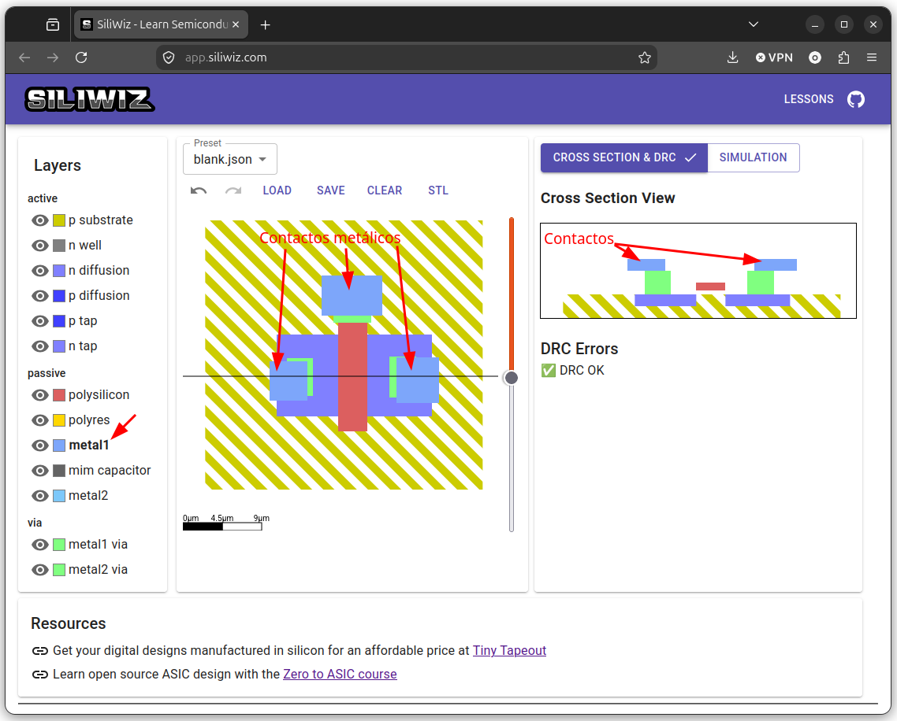

# Colocando los contactos metálicos

Encima de las vías colocamos los **contactos metálicos**. Seleccionamos la capa **metal1** y colocamos rectángulos sobre las vías

  

No hay errores de DRC. Comprobamos que el contacto metálico de la puerta también está en contacto con su vía

  

