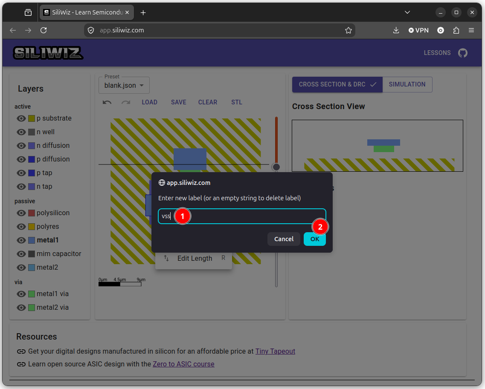

# Colocando las etiquetas

Lo siguiente es **identificar** los contactos asignándoles un **nombre** a través de una **etiqueta**. Vamos a colocar las etiquetas para establecer las conexiones con **las alimentaciones**. Así, asignaremos la **fuente** a **vss** (0v), el **drenador** a **vdd** (1.8v) y la **puerta** a **in**. La etiqueta **in** es la que utilizaremos para introducir la tensión de entrada para simular el MOSFET N

Primero vamos a conectar **la fuente**. Pinchamos con el **botón izquierdo** del ratón sobre el contacto metálico de la fuente. Aparece un menú. Pinchamos en **Set Label**

  

Aparece un diálogo donde escribimos `vss` y pinchamos en OK

  

Vemos que aparece el texto **vss** en la fuente

  

Repetimos el mismo proceso para el drenador y la puerta. Así es como queda

  

