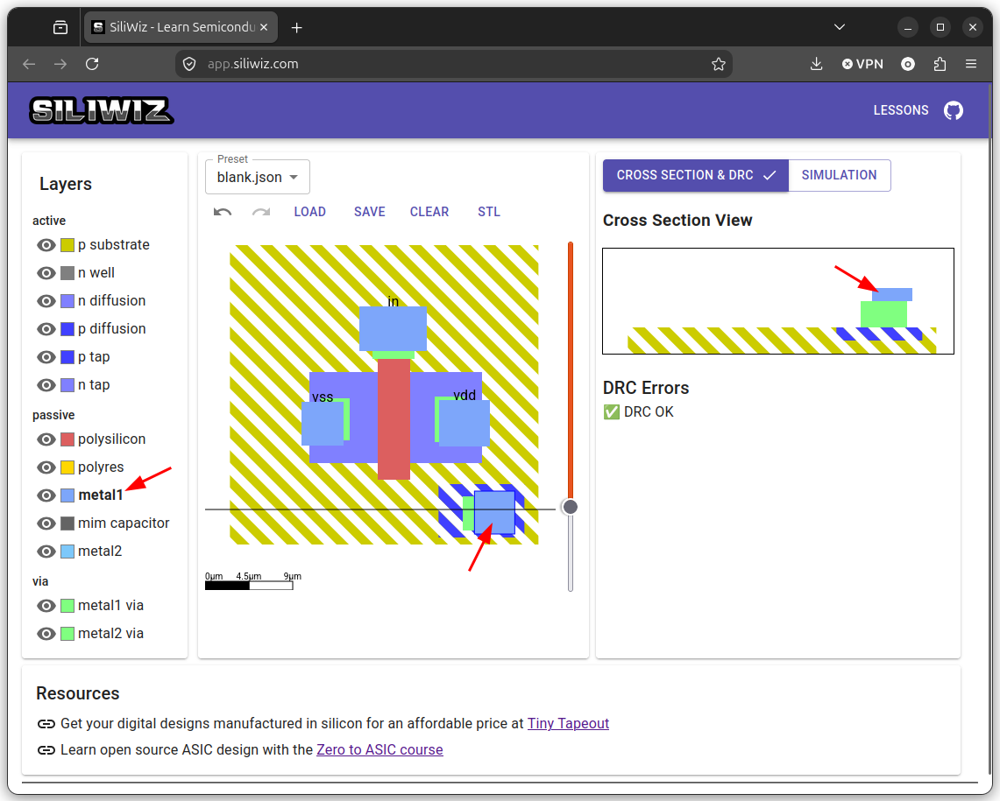
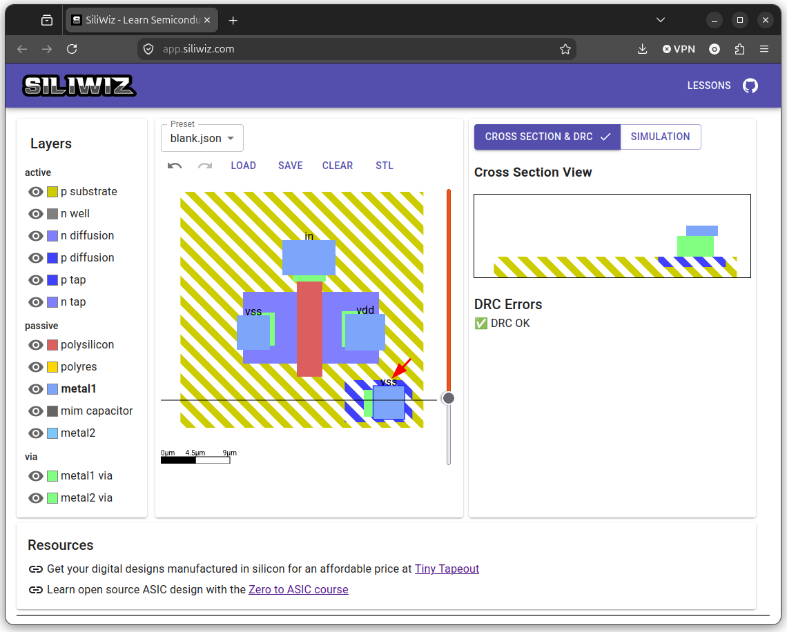

# Conexión del sustrato a vss

Para terminar el transistor, hay que conectar el **sustrato p** a la tensión `vss`, es decir, a **gnd**. Para realizar esta conexión primero hay que colocar una zona **p tap**. Pinchamos en la capa **p tap** y la colocamos

  

Ahora colocamos la **vía**

  

A continuación el **contacto metálico**

  

Y por último ponemos la **etiqueta** para conectarlo a `vss`

  

¡¡Ya tenemos el MOSFET finalizado!!
