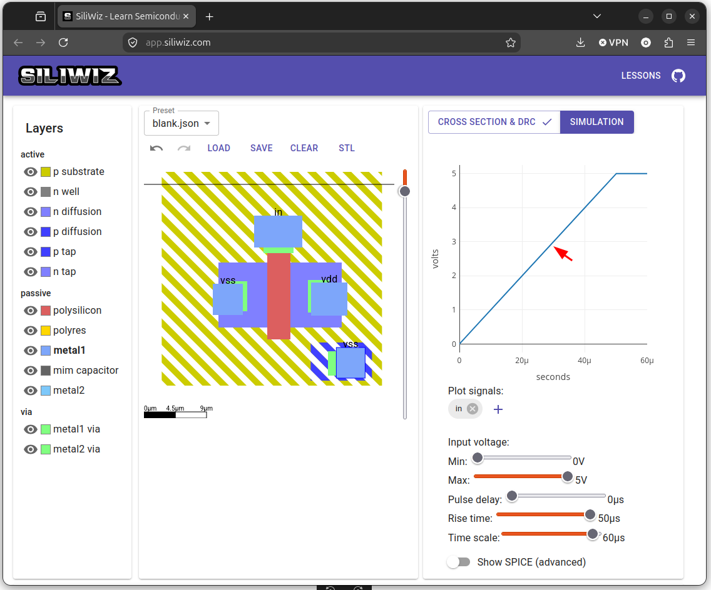
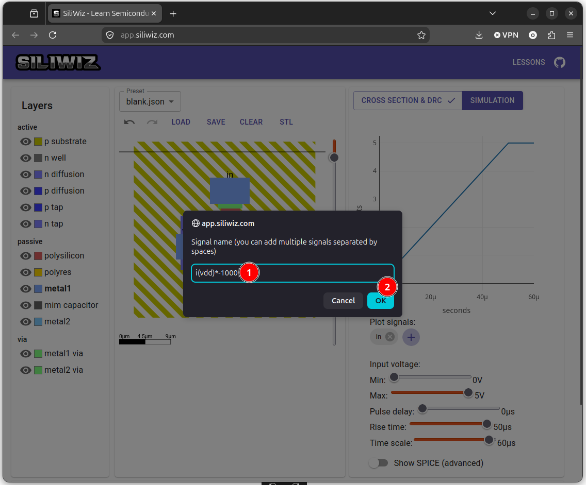
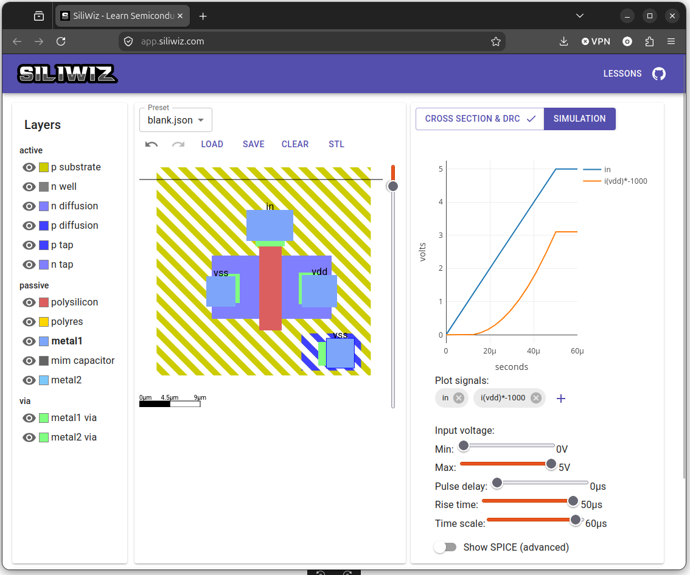

# Simulando el mosfet

Vamos a simular el MOSFET. Pinchamos en el botón que pone **SIMULATION**

  

De momento no aparece ninguna gráfica. Lo que queremos medir es **la corriente** que atraviesa **el drenador**, que en notación de spice se escribe como `i(vdd)`. Primero eliminamos la etiqueta `out`

  

Al hacerlo se refresca la gráfica y se pinta la señal de entrada `in`, que es la que se introduce por la puerta. Se trata de una **rampa de tensión** que va desde **0** hasta **5v**

  

Queremos que se dibuje **la corriente que atraviesa el drenador**. Pinchamos en el botón **+** para añadirla

  

Aparece un panel de entrada donde escribirmos $i(vdd)*-1000$ y pulsamos **OK**. Lo que queremos que se dibuje es **la corriente** que circula por el drenador, que se denota como $i(vdd)$. Esa corriente **la multiplicamos por -1000** para que tenga signo positivo por un lado (sólo se pueden dibujar corrientes positivas en la herramienta de simulación) y para escalarla y que se vea junto con la tensión de entrada

  

En la gráfica aparece la corriente, en color naranja

  

Comprobamos que cuando la tensión de la puerta es 0, NO hay corriente. Y cuando la tensión es de 5v, se tiene la corriente máxima. Es decir, que funciona correctamente **como un interruptor**: conduce o no conduce según que la entrada sea `1` ó `0`

¡¡El mosfet funciona!!

