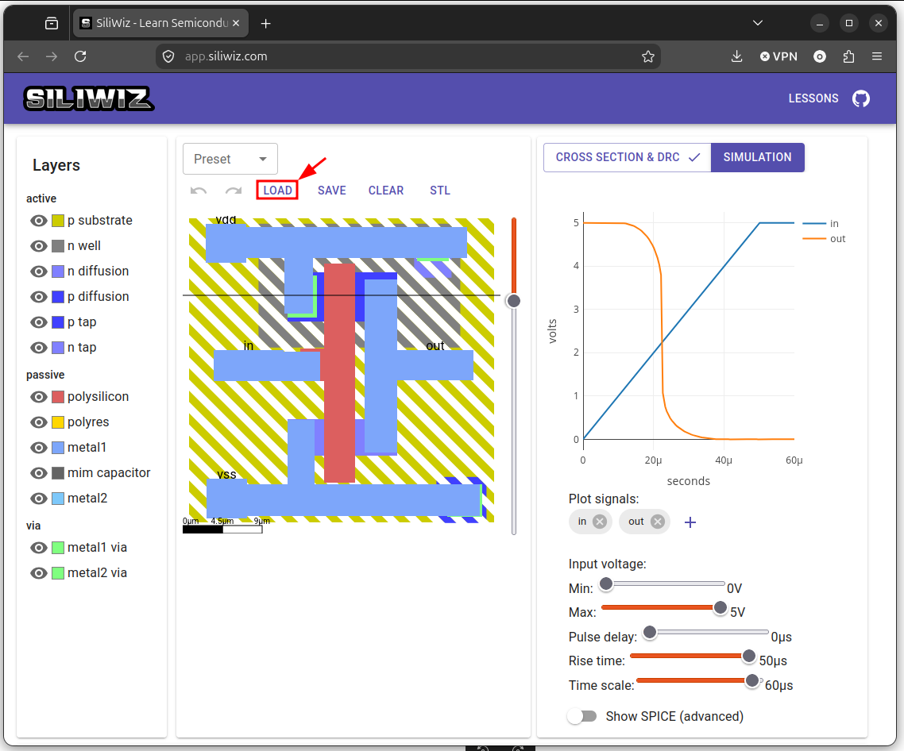

# Cargando un diseño

Por supuesto también podemos cargar un fichero grabado previamente. Partimos del estado inicial de Siliwiz, abriéndolo en una nueva pestaña. Aparece el diseño del inversor

Pinchamos en el **botón LOAD**

  

Nos aparece la ventana del navegador para seleccionar el fichero a subir. Elegimos el que habíamos guardado anteriormente, que lo hemos renombrado a `mosfet-n.json`

  

Se carga el nuevo diseño y se muestra su simulación

  

