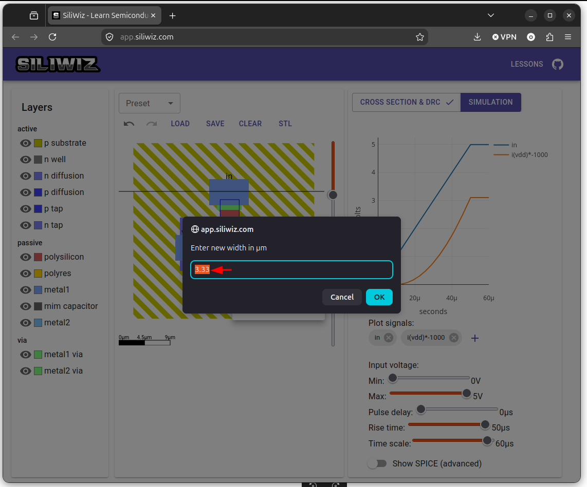
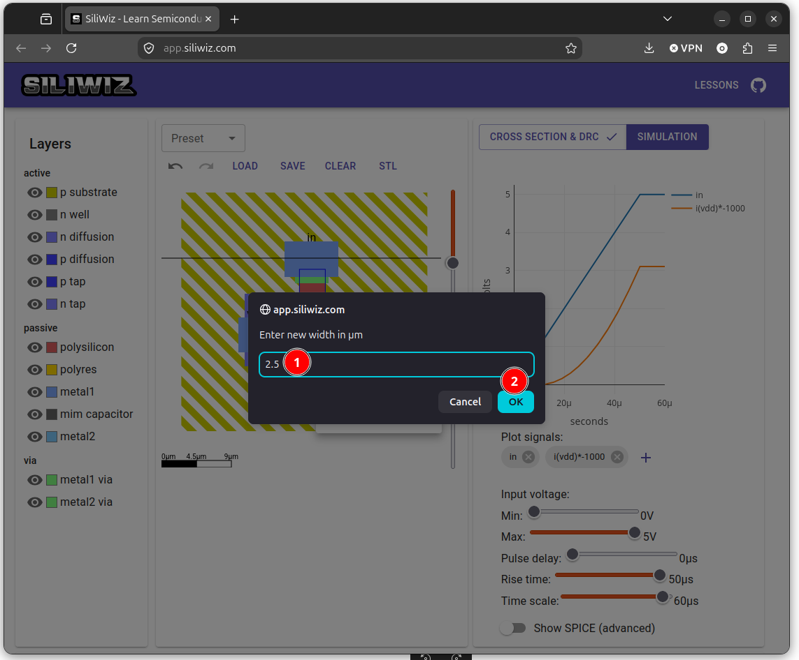
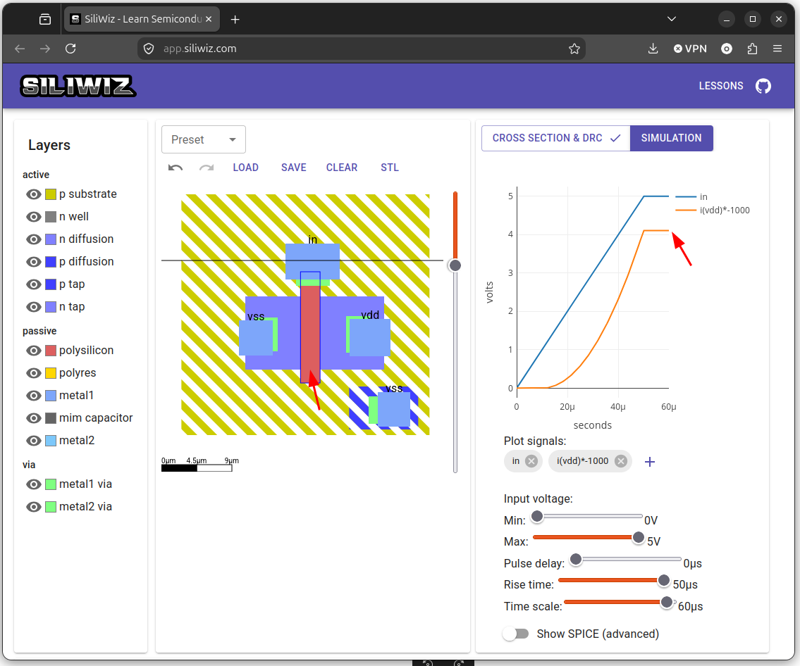

# Modificando el diseño

Lo interesante de la simulación es que nos permite profundizar en qué parámetros del transistor afectan a su funcionamiento. En el diseño actual vemos que la corriente que circula por el drenador es de **3mA** (En la gráfica vemos 3, pero recordemos que es el resultado de multiplicar el valor real por 1000)

  

Vamos a modificar la **longitud del canal N del mosfet**, esto es, cambiando **la anchura del polisilio**. El objetivo es ver cómo afecta esta anchura a la corriente que pasa por el drenador

Lo podemos hacer de dos maneras:

1. **Borrando el polisilicio**, y dibujando uno nuevo. Para borrar pinchamos en el polisilicio con el **botón izquierdo** del ratón y luego seleccionamos **Delete**. Tras ello volvemos a dibujar el polisilicio como ya sabemos

2. **Cambiando la anchura del polisilicio**. Es la opción que vamos a utilizar. Pinchamos con el **botón izquierdo** en el polisilicio

  

Vemos el valor de la anchura actual, que en este ejemplo era de **3.3**

  

Vamos a poner un ancho menor, como por ejemplo **2.5**

  

Pulsamos OK. Cambia la longitud del canal (que es la anchura del polisilicio) y vemos en la simulación cómo **la corriente ha aumentado hasta 4mA**

  

