# Visualizando el modelo en 3D

Desde Siliwiz exportamos el **modelo 3D** en **formato STL**, que luego podemos editar con herramientas como **Blender** o **FreeCad**, así como imprimir en 3D

## Exportando a STL

Para exportar el diseño actual al formato STL pinchamos en el **botón STL**

  

Se descarga el fichero `siliwiz.stl`

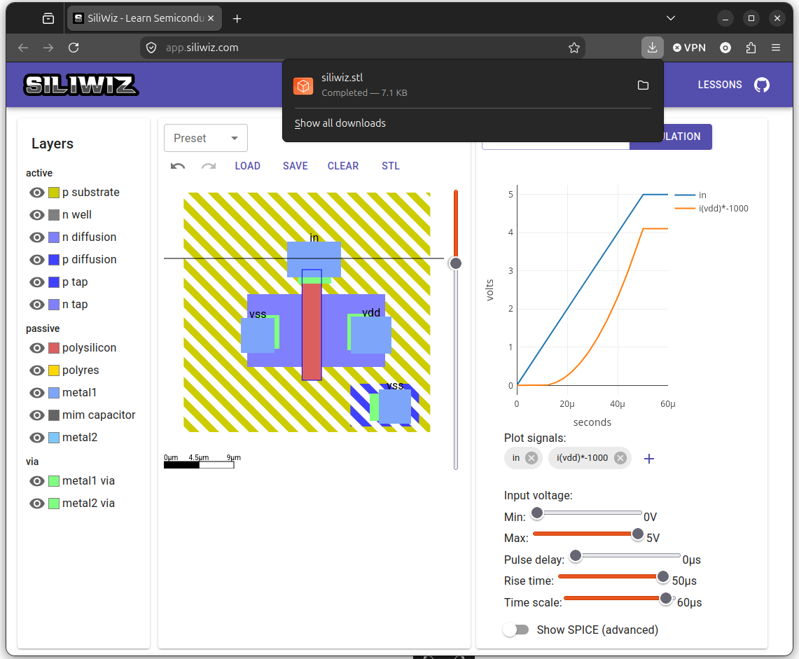  

Lo renombramos a `mosfet-n.stl`. Ya lo tenemos listo para importar en cualquiera de los programas de diseño 3D 

## Usando Freecad

Desde [FreeCAD](https://www.freecad.org) podemos visualizar el modelo 3D. Sin embargo, el formato STL NO incluye colores, por lo que lo veremos todo en **tonos grises**. Aprovecharemos este apartado no sólo para importar el STL y verlo en gris, sino para convertir todos sus componentes a **objetos sólidos** de FreeCAD, para tenerlos por separados y poder moverlos, editarlos y cambiar sus colores

### Importando el STL

Para Importar el fichero **STL** desde Freecad pinchamos en **File/Open**

  

Seleccionamos el archivo **mosfet-n.stl** y pulsamos **Open**

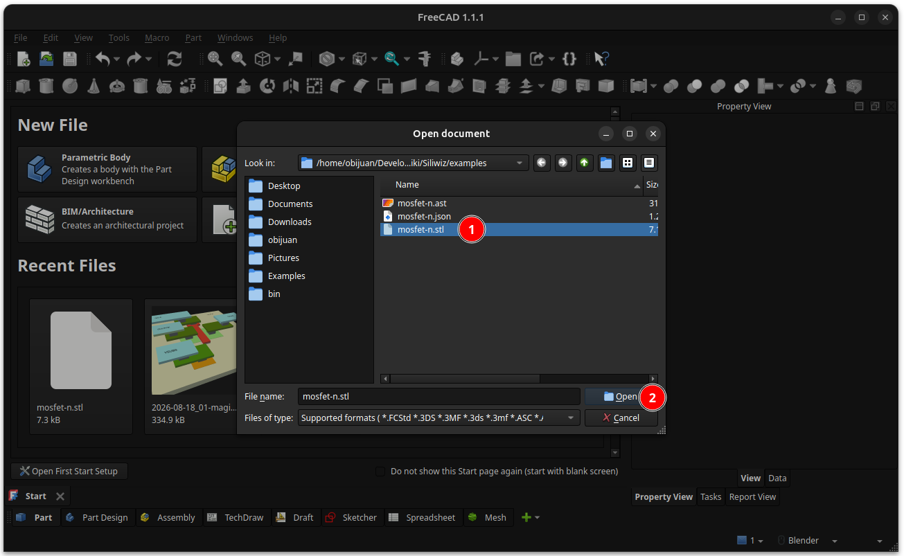  

El fichero **STL** se abre, y esto es lo que vemos

  

Como lo que se muestra es la **vista superior**, y el formato STL no permite definir colores, sólo vemos la parte superior del sustrato y no se aprecian el resto de capas. Para verlas mejor hay que **rotar** el diseño, y así lo vemos en un **tono de grises**

  

Vamos a cambiar el modo de ver el STL, para apreciar todas las **mallas**, ya que STL es un **formato de Mallas** (no define sólidos, sino superficies constituidas a partir de triángulos). Seleccionamos el objeto **mosfet-n** en la izquierda, luego nos vamos a la ventana de propiedades (Property view) y seleccionamos la pestaña de **View**. Dentro de ella cambiamos la propiedad **Display Mode** a **Flat Lines**

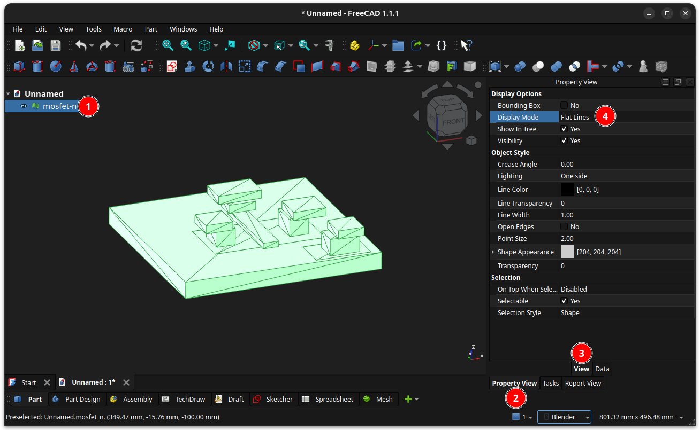  

Esto es lo que vemos cuando el objeto deja de estar seleccionado

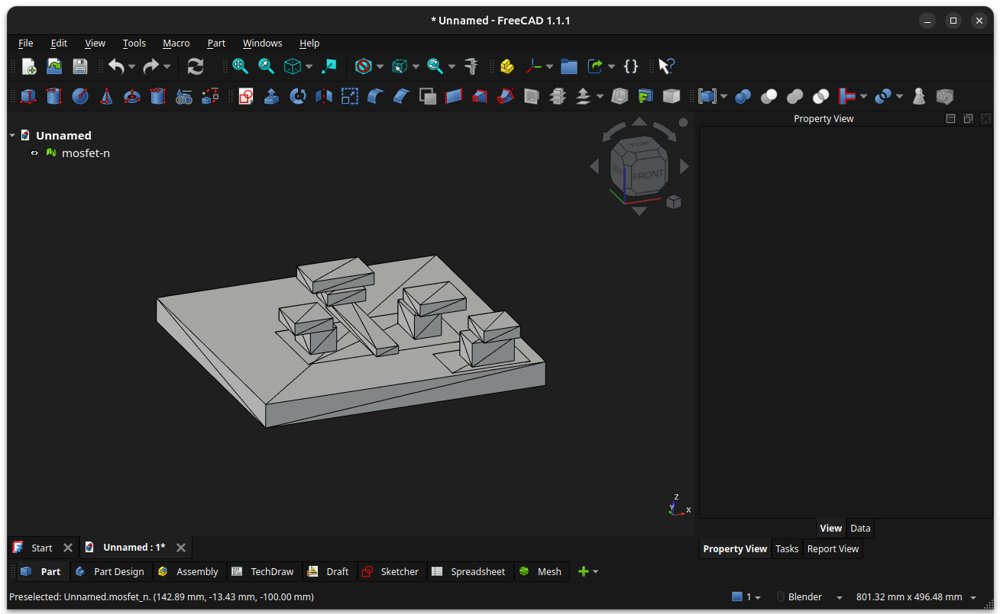  

Ahora además de las **cajas** que forman las diferentes zonas del diseño vemos los **triángulos** que las forman. Es la típica vista de mallas

### Guardando en formato FreeCad

Antes de pasar a editar el STL, guardamos el diseño en formato nativo de FreeCAD, con el nombre **mosfet.FCStd**. Pinchamos en **File/Save as**

  

Escribimos el nuevo nombre y le damos a **Save**

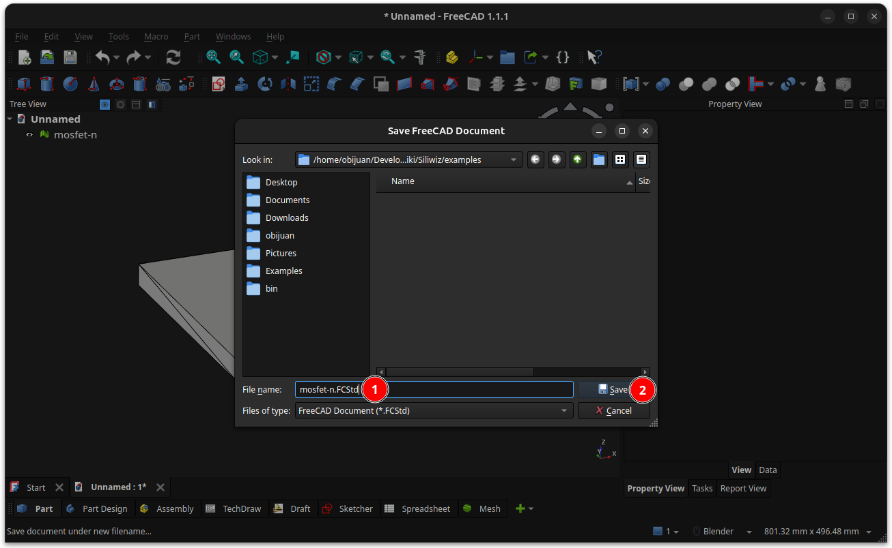  

Ahora nos aparece el nombre del diseño dentro de FreeCad

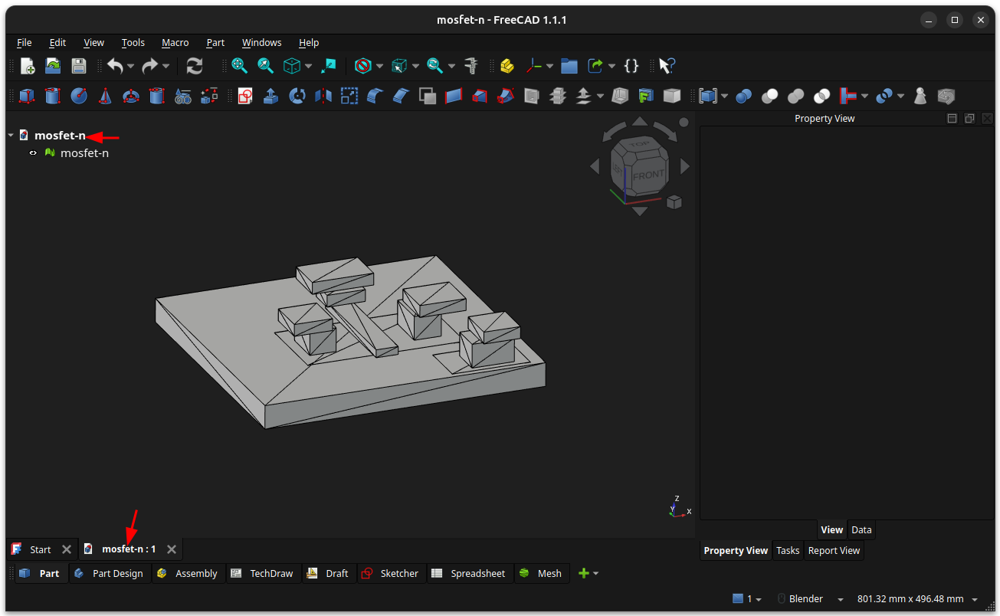  

¡Ya está todo listo para empezar a editarlo! (si es que queremos...)

### Separando los componentes

Lo que vemos es **un único objeto**, pero nosotros sabemos que en realidad está formado por componentes independientes, que son las diferentes cajas. Queremos obtener esas cajas como **objetos aislados**, para tratarlos individualmente. Esto lo hacemos desde el **banco de trabajo mesh**

Nos vamos al banco de trabajo mesh. Esto depende de cómo tengas configura Freecad. Yo en mi caso lo tengo accesible en un botón inferior, pero también se puede acceder en el menú **View/Workbench/Mesh**. Luego seleccionamos el objeto **mosfet-n** y pinchamos en el icono correspondiente a la opción **Split by components**, que también está accesible desde el menú **Meshes/Split by components**

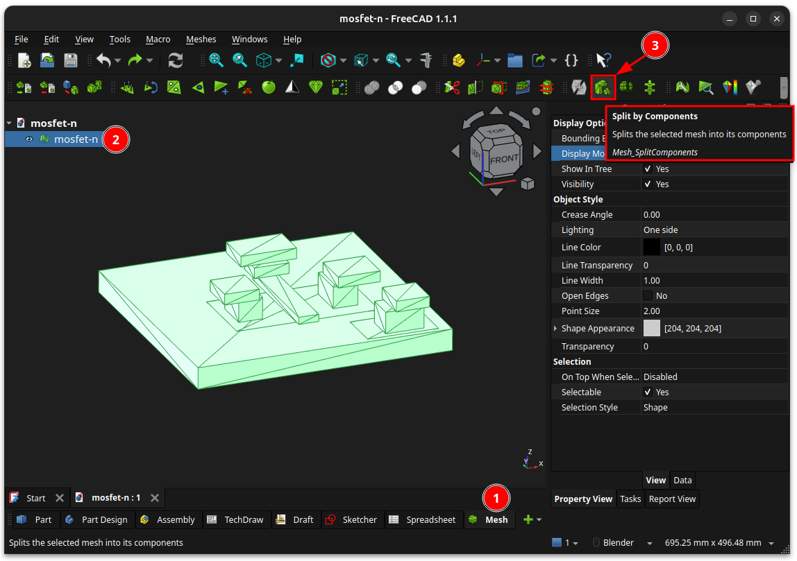  

Además del objeto original **mosfet-n**, que sigue estando, han aparecido **12 componentes nuevos**

  

El objeto **mosfet-n** lo podemos borrar, porque ya no lo necesitamos. Lo seleccionamos y presionamos **supr**

  

Se nos selecciona automáticamente el componente que está debajo del que hemos borrado, cuyo nombre es **Component**. Como está seleccionado lo vemos en diferente color que el resto. ¡Se trata del sustrato!

Como experimento vamos a **Ocultar el sustrato**, pinchando en el ojo que tiene a su izquierda. El **sustrato desaparece**, pero el resto de componentes siguen ahí. Ahora son objetos independientes

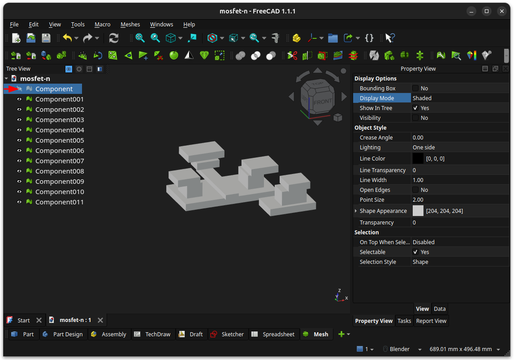  

### Convirtiendo el sustrato p a objeto sólido

Cada uno de los nuevos componentes los vamos a convertir a un **objeto sólido**, para poder tratarlos como cualquier otro objeto de Freecad, y por así sacar planos, realizar uniones, intersecciones, ediciones de propiedades...

El proceso lo vamos a hacer para TODOS LOS COMPONENTES, sin embargo sólo lo mostraremos para el **sustrato p**, y luego habrá que repetir los mismos pasos para los otros componentes

Lo primero es **cambiar el nombre** para hacerlo más reconocible. Lo cambiamos de **Component** a **sustrato-tmp**. El sufijo **-tmp** lo usamos para indicar que es un componente **temporal**, que luego borraremos cuando tengamos el final. El nombre se **cambia** fácilmente pulsando en el nombre del componente con el **botón derecho** y usando la opción **rename**. El resto de componentes los ocultamos para no generar ruido

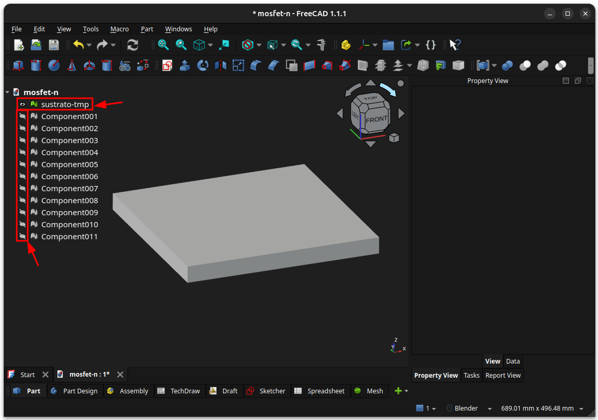  

El **sustrato p** es una malla. Vamos a cambiar sus propiedades, como ya sabemos, para ver todos los triángulos

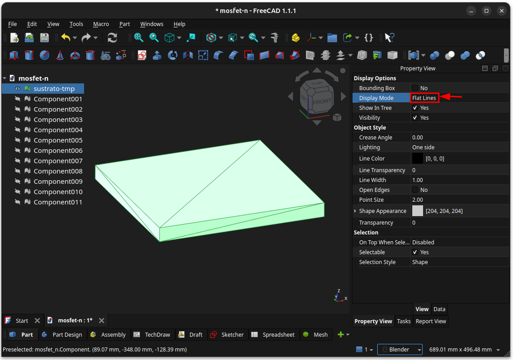  

El primer paso es convertirlo a una **forma**, que es un objeto de freecad no sólido. Vamos al **banco de trabajo Part** y pinchamos en la opción **Part/Shape from mesh**

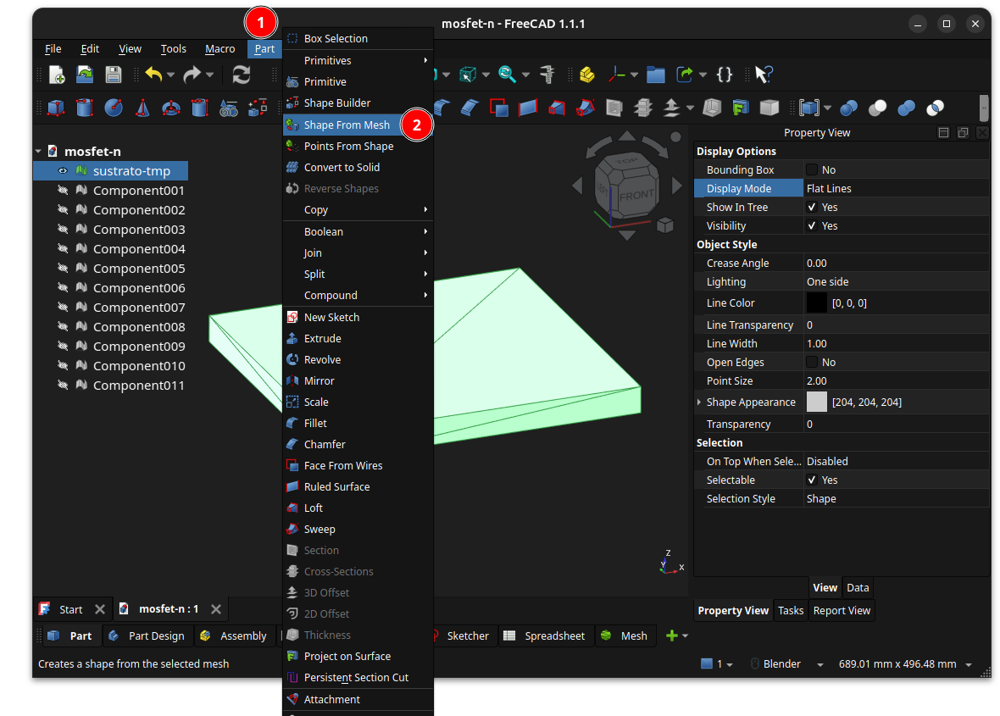  

Nos aparece un cuadro de diálogo. Lo ignoramos, pinchando en **OK**

  

Aparece un nuevo componente, llamado **Component012**, que es el sustrato p convertido ya a una forma. El objeto original NO desaparece por lo que lo ocultamos

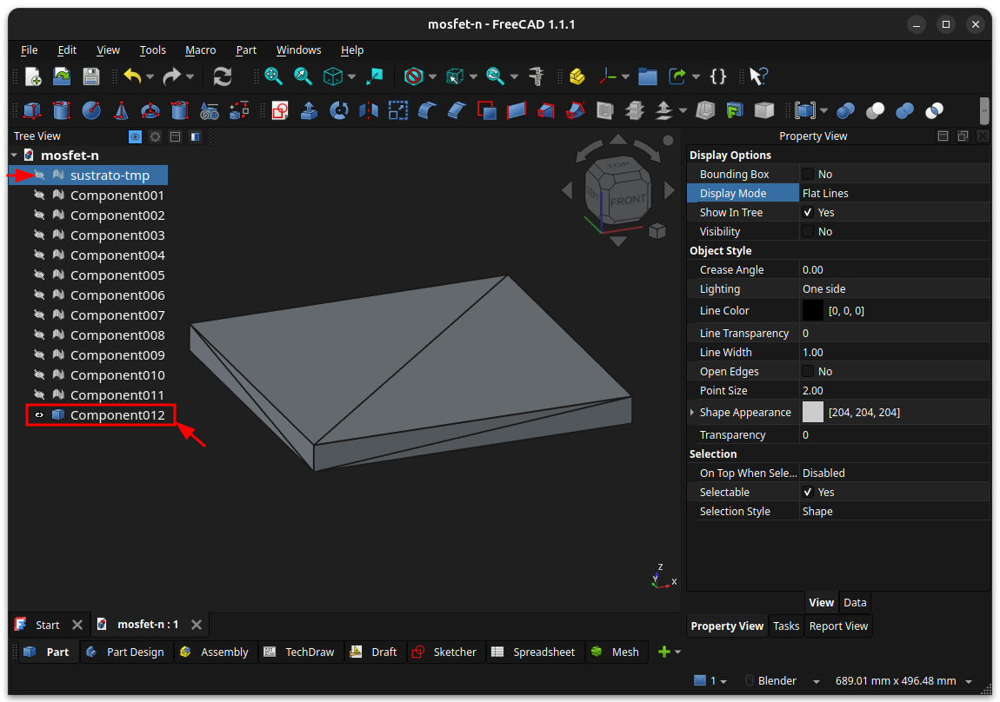  

Vamos a convertirlo a **un objeto solido** de Freecad. Con este objeto seleccionado pinchamos en **Part/Convert to Solid**

  

Nos aparece un nuevo objeto, llamado **Component012 (solid)**, que ya sí que es un objeto de freecad sólido. Es decir, que es macizo en su interior. Aprovechamos para ocultar el anterior **Component012**

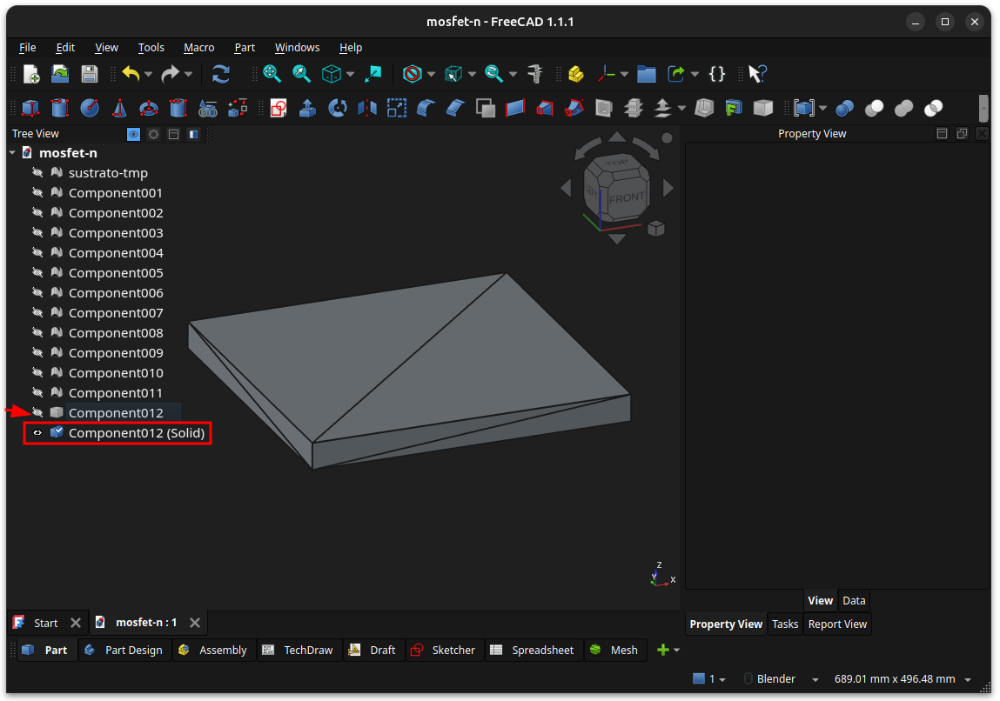  

Se trata de un objeto sólido, pero todavía **se ven los triángulos** que formaban la malla original. Para eliminarlos tenemos que **refinar** el objeto. Lo seleccionamos y pinchamos en **Part/Copy/Refhine Shape**

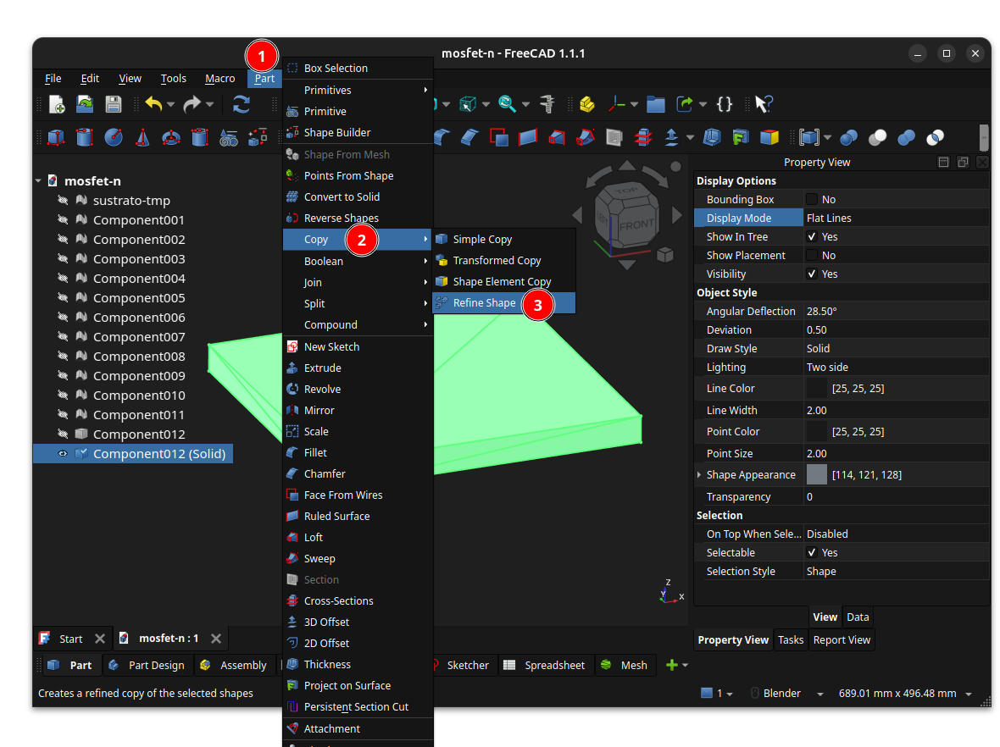  

Ahora ya nos aparece un nuevo objeto que no tiene los triángulos: se han refinado, y sólo tiene las caras de la caja

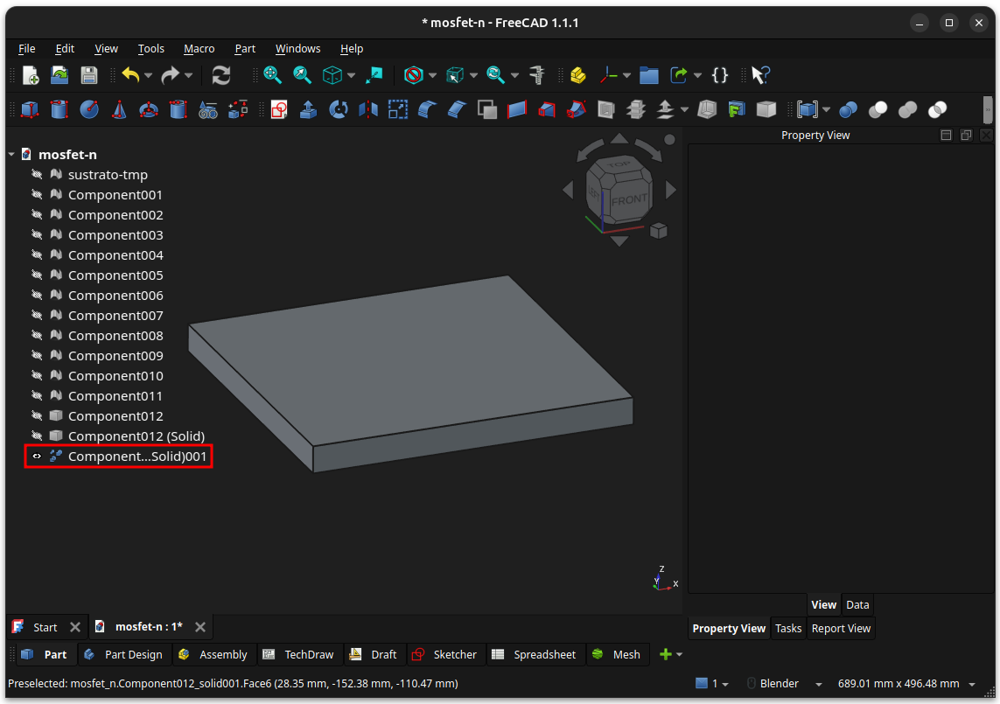  

Este nuevo objeto creado no es independiente, sino que está asociado al objeto anterior **Component012(Solid)**. Para dejarlo como **un objeto independiente**, creamos **una copia simple**. Lo seleccionamos y pulsamos en **Part/Copy/Simple copy**

  

Nos aparece ya nuestro **objeto final**, independiente de las operaciones anteriores

  

Ahora hacemos limpieza y **borramos** todos los objetos generados a partir del sustrato original, salvo este último

  

Por último cambiamos el color. Seleccionamos el objeto y ponemos color amarillo

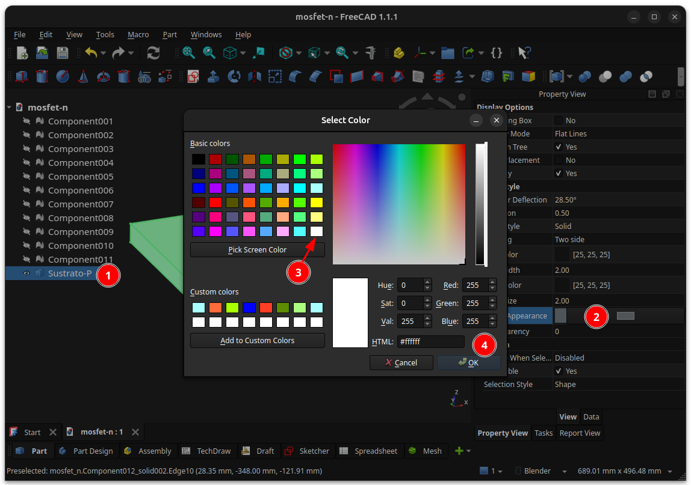  

Este es el resultado final. Mostramos todos los objetos

  

### Convirtiendo el resto de componentes a objetos sólidos

Hacemos los mismo con el resto de componentes. Resumimos aquí los pasos:

1. **Convertir la malla a forma**. Comando: **Part/Shape from mesh**
2. **Convertirlo a objeto sólido**: Comando: **Part/Convert to Solid**
3. **Refinar el objeto**: Comando: **Part/Copy/Refhine Shape**
4. **Crear una copia simple**: **Part/Copy/Simple copy**
5. **Renombrar el objeto final**
6. **Borrar todos los objetos intermedios** anteriores generados
7. **Cambiar el color**

Así es como queda el **modelo 3D**

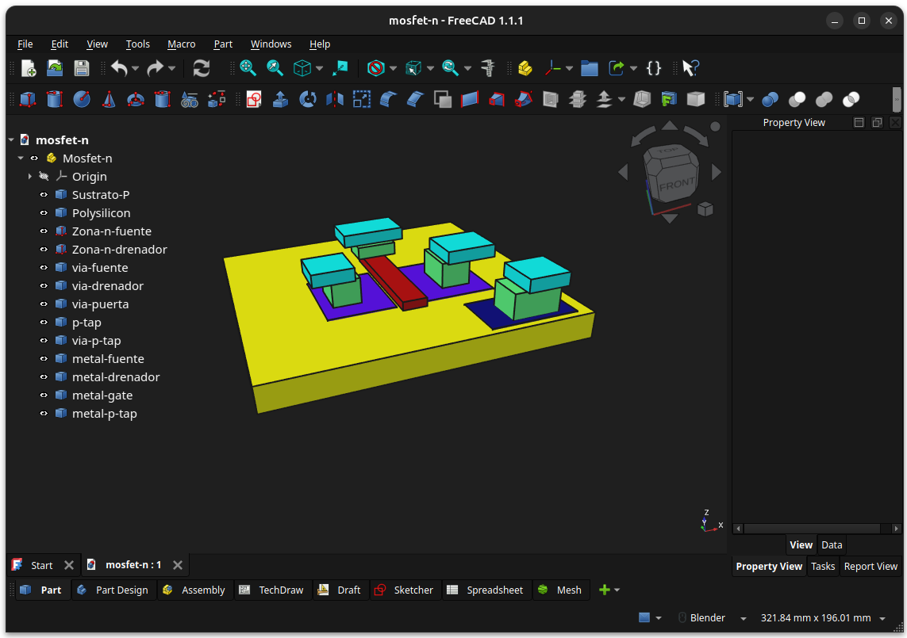  

### Añadiendo texto

Vamos a añadir el texto a los contactos para indicar cuál es cada uno. Pasamos al banco de trabajo **draft**. Como primer ejemplo colocaremos el texto de la fuente: **SOURCE**. Pinchamos sobre la cara superior del contacto metálico de la fuente para seleccionarla y luego pinchamos sobre el **plano de trabajo** para que se nos sitúe encima de ese contacto

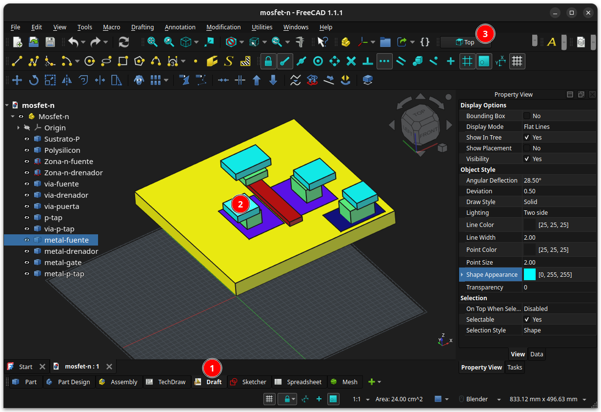  

El plano de trabajo se sitúa encima del contacto de la fuente. Se convierte en un plano de trabajo **custom**

  

Pinchamos ahora en el icono **Shape from text**

  

Se abre un nuevo diálogo en la derecha. Escribimos el texto, `SOURCE`, luego ponemos **el tamaño**, por ejemplo 6, situamos el ratón en la zona de la rejilla donde queremos poner el texto y apretamos el botón izquierdo del ratón. Por último pinchamos en **OK**

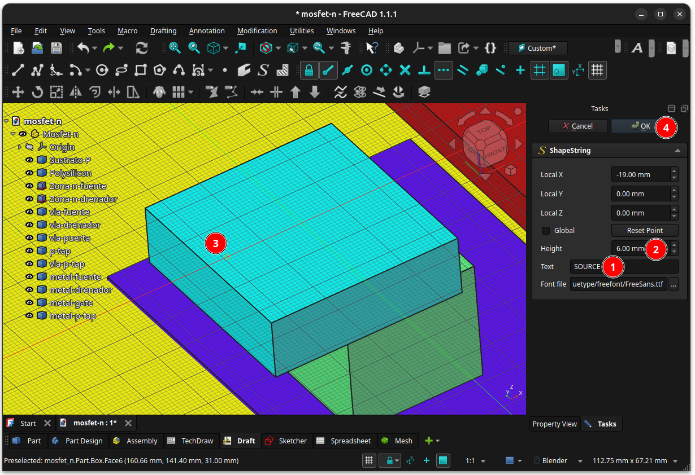  

Nos aparece el texto `SOURCE` sobre el contacto de la fuente

  

El texto se pone en el mismo plano que la superficie del contacto. Para que se vea mejor vamos a **subirlo 1 unidad**. Seleccionamos el texto y con el botón derecho damos a la opción de **Transform**. Lo desplazamos 1 en el sentido de **W**. Pinchamos en OK

  

Así es como se ve el texto

  

Cambiamos sus propiedades para que tenga un **color Negro**, y que resalte más, y renombramos el objeto a `label-source`. Esto ya lo sabemos hacer

  

Repetimos el proceso con el resto de etiquetas

  

